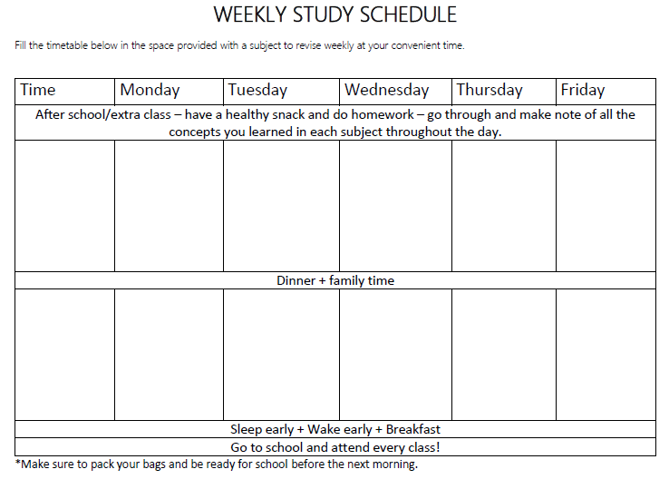
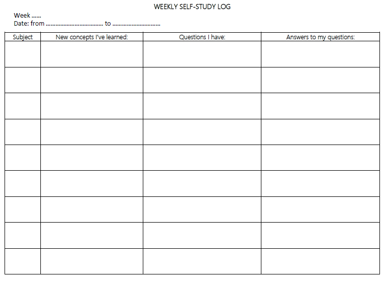

* Find out and make a synopsis of all the topics and subtopics you will cover in the academic year and frequently follow your progress in each.
* When you read a topic, first skim, highlight/identify keywords, and read again forming questions to make short notes on the key ideas you’ve understood. 
* Review notes within 24 hours of taking them – this will help in your recall of the information in future.
* Make and follow a weekly after-school study timetable of all the subjects you need to study.
* At the end of every school week, write down all the new things you’ve learned in each subject, make a note of what you’ve not understood and find out answers to your questions.
* Have a study buddy or a study group to help you answer any questions you may have from concepts that are not clear to you in your respective subjects. Teach others what you’ve understood.
  Do practice questions topic wise every time you study a certain topic. 
* Make corrections to questions you get wrong.
* Do past papers before a test/exam.

The table below shows an example of a weekly study schedule.

- - -

 

The table below shows an example of a weekly self-study log.

