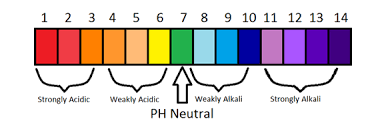
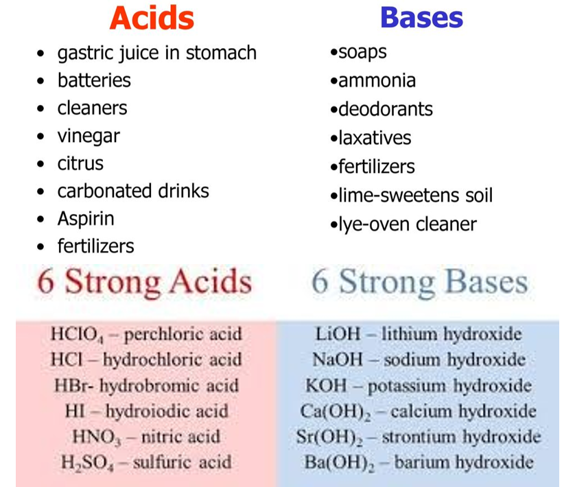
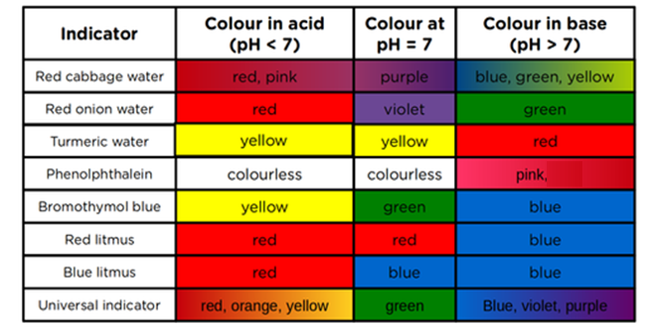
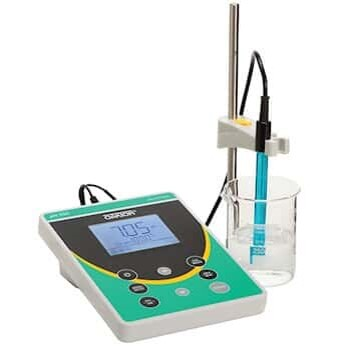

<!--StartFragment-->

•Acids are substances turn litmus red and have a pH of less than 7

•Alkalis are substances that turn litmus blue and has a pH more than 7. Alkalis are soluble bases.

•Acids and Bases can cancel each other out to become neutral

•Neutral substances have a pH of 7

•The pH scale measured using Universal Indicator shows the strength of acids and alkalis from 1 to 14.

<!--EndFragment-->

Pure water is neutral.

<!--StartFragment-->

The pH of soil affects flower colour. <!--StartFragment-->

•Hydrangea flowers are blue in acidic soil with a pH of 5.5 or lower. Blooms are pink if soil pH is 7 or higher.

<!--EndFragment-->

# Indicators

<!--StartFragment-->

Indicators are substances that change colour in solutions of different acidity and alkalinity.

Examples are:

•natural pH indicators include: Beets: A very basic solution (high pH) will change the color of beets or beet juice from red to purple. Blackberries: Blackberries, black currants, and black raspberries change from red in an acidic environment to blue or violet in a basic environment

•Red cabbage

•Litmus

•Phenolphthalein

•Methyl orange

•Universal indicator

<!--EndFragment-->

<!--StartFragment-->

•Litmus, phenolphthalein, methyl orange etc do not show how strong or weak an acid or alkali is, but Universal indicator does.

•Universal indicator is a mixture of indicators that give a range of colours which correspond to the pH of a solution.

•Using a pH meter is a more accurate way of measuring the pH numerically.

•Using pH paper and Univeral Indicator solution shows the colour change and is a simpler way to measure pH.

<!--EndFragment-->

# Neutralisation

This is a chemical reaction where an acid and base react together to form a salt and water.

Acid + Base → Salt + Water

Alkalis are bases that are soluble in water.

Acid + Alkali → Salt + Water

Acids and Alkalis cancel each other out (neutralize)

<!--StartFragment-->

Neutralization produces substances called salts.

•Hydrochloric acid produce ‘chloride’ salts

•Sulphuric acid produces ‘sulphate’ Salts

•Nitric acid produces ‘nitrate’ salts

hydrochloric acid + sodium hydroxide → sodium chloride + water

sulphuric acid + lithium hydroxide → lithium sulphate + water

nitric acid  + potassium hydroxide → potassium nitrate + water

<!--EndFragment-->