<!--StartFragment-->

Elements are the building blocks of all matter. The Periodic Table of Elements show all the 118 elements that make up all matter on Earth. Each element is made up of its own special type of atom.

<!--EndFragment-->

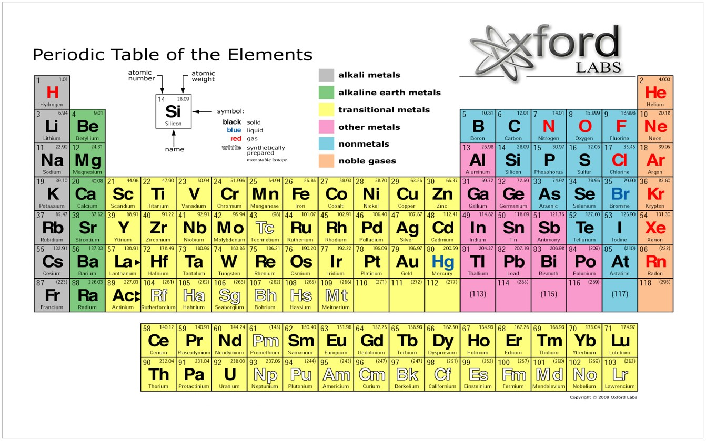

## ATOM

<!--StartFragment-->

•It is the fundamental particle that makes up all matter.

•It is the smallest particle of an element that has all the properties of that element.

•Can be represented as a tiny ball…

<!--EndFragment-->

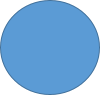

<!--StartFragment-->

……but it is actually made up of electrons whizzing around a central nucleus containing protons and neutrons.

<!--EndFragment-->

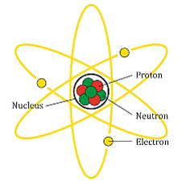

<!--StartFragment-->

## ELEMENTS 

– are made up of a certain type of atom. A pure substance contains only one type of atom… (an element is considered to be  a pure substance)

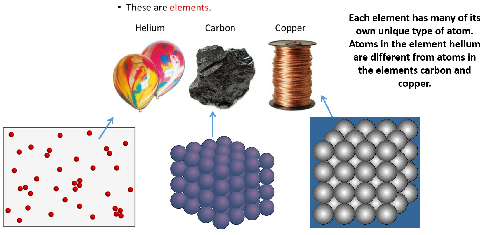

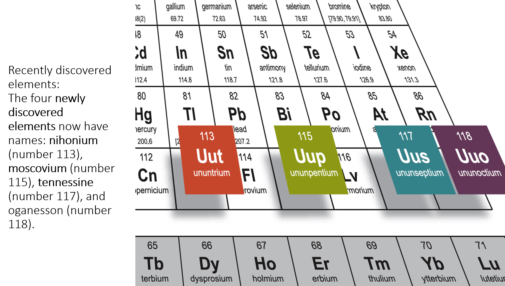

<!--StartFragment-->

## COMPOUND 

– made up of different elements (different kind of atoms joined together)\
 To make a compound, the atoms of the different elements must chemically join together. If they don’t join, then it is a mixture of elements. \
Other compounds include:

<!--EndFragment-->

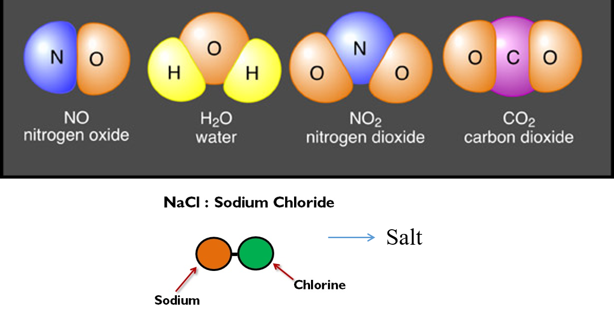

<!--StartFragment-->

### Molecule – 

a general word to describe many atoms joined together

<!--EndFragment-->

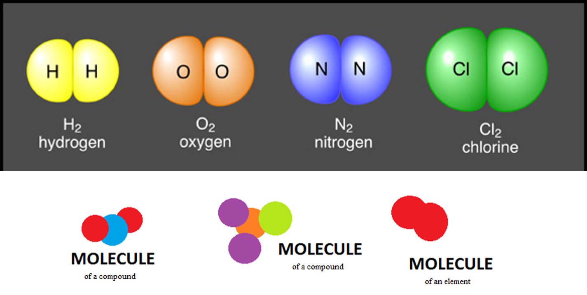

<!--StartFragment-->

### MIXTURE 

– having many molecules of compounds and/or molecules of elements mixed together.

<!--EndFragment-->

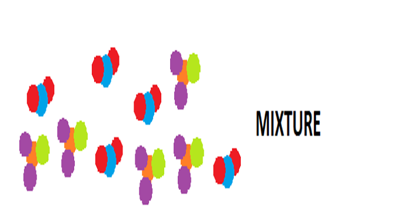

<!--StartFragment-->

A pure substance contains only one type of molecule of an element or one type of molecule of a compound…

AIR IS A MIXTURE

The air we breathe is not pure. It is made up of a mixture of gases including nitrogen, oxygen, argon, water vapour and carbon dioxide.

<!--EndFragment-->

In summary:

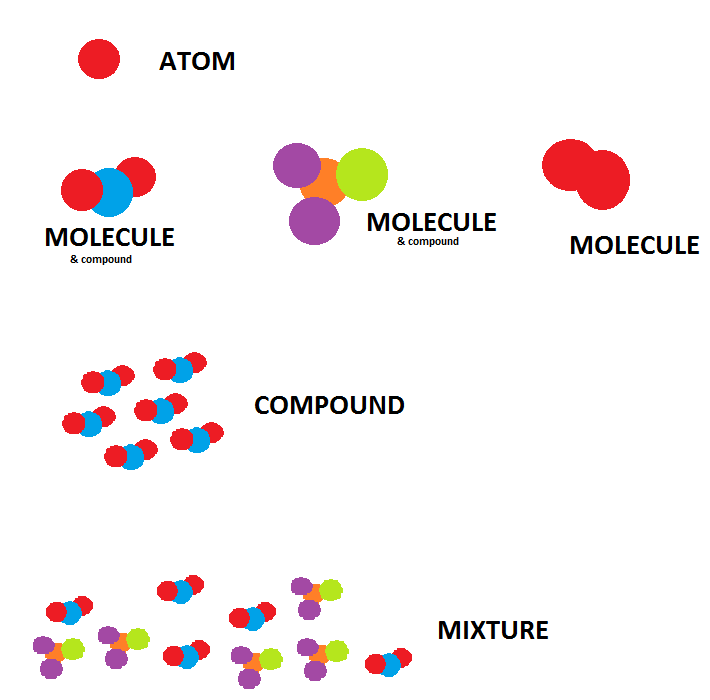

<!--StartFragment-->

<!--StartFragment-->

<!--EndFragment-->

## Metals vs Non metals

<!--EndFragment-->

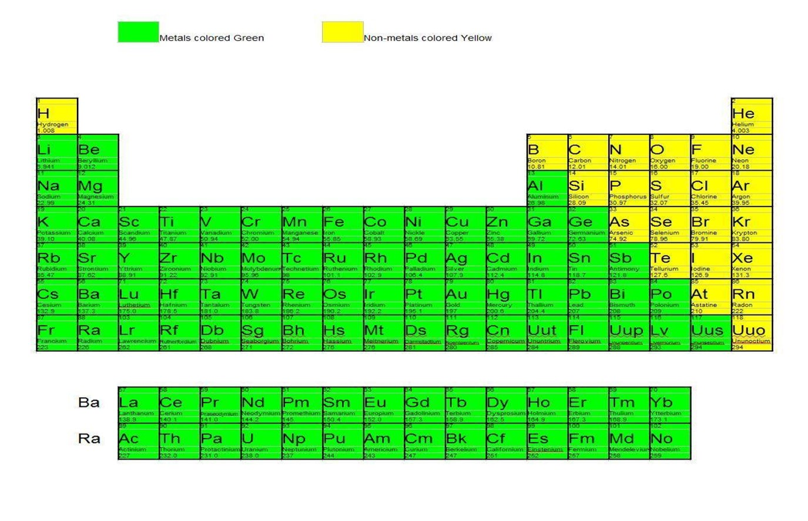

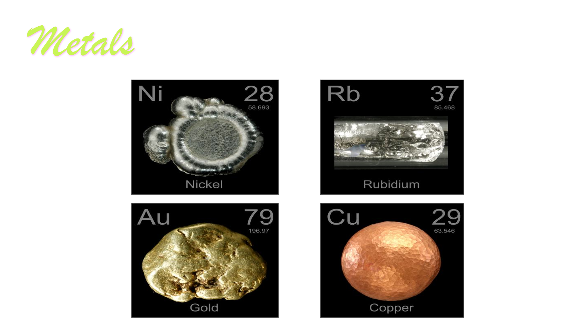

<!--StartFragment-->

<!--EndFragment-->

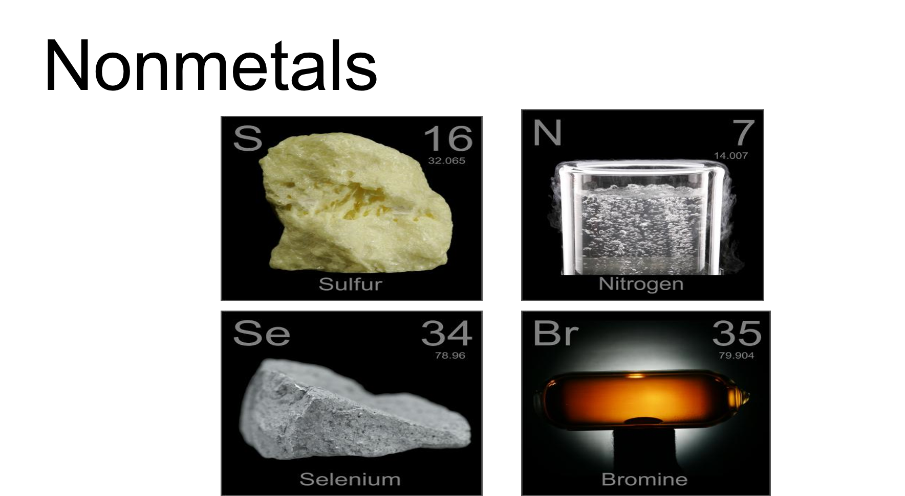

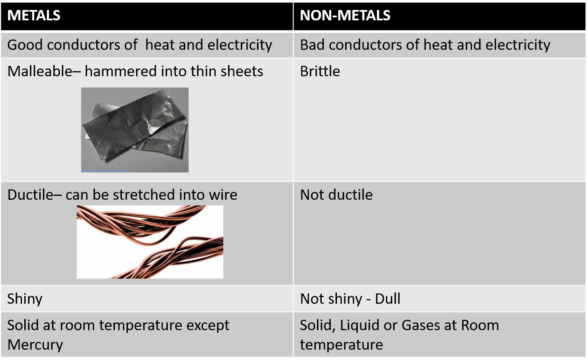

#### Metal ores – where metals are extracted from

<!--EndFragment--><!--StartFragment-->

•Ores are naturally occurring rocks that contain metals or metal compounds in sufficient amounts to make it worthwhile extracting them.

•Most of the compounds found on Earth including metal ores were formed millions of years ago.

•Metal ores are rocks containing a metal which can be used as a source of the metal.

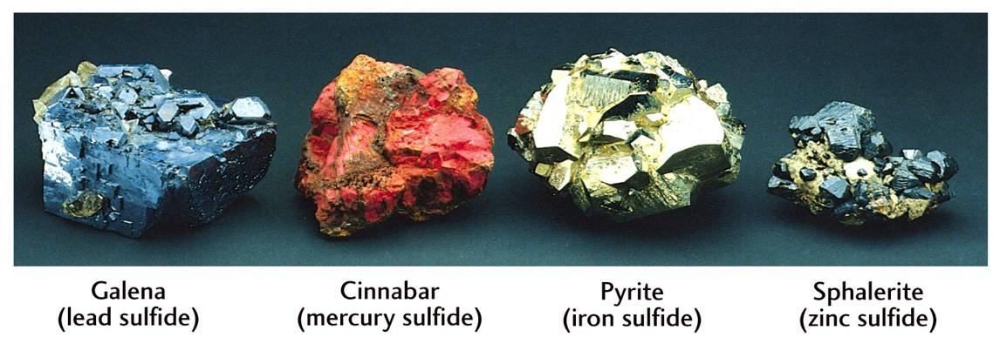

<!--StartFragment-->

##### How do elements form compounds?

<!--EndFragment--><!--StartFragment-->

•Two elements can be combined by heating them.

•Energy is often given out when elements react to form compounds.

E.g: Iron and Sulphur can be joined together to form a compound called Iron Sulphide.

iron + sulphur → iron sulphide

Bonds are formed between iron and sulphur atoms to make them bonded together in iron sulphide.

##### Naming Compounds

<!--EndFragment-->

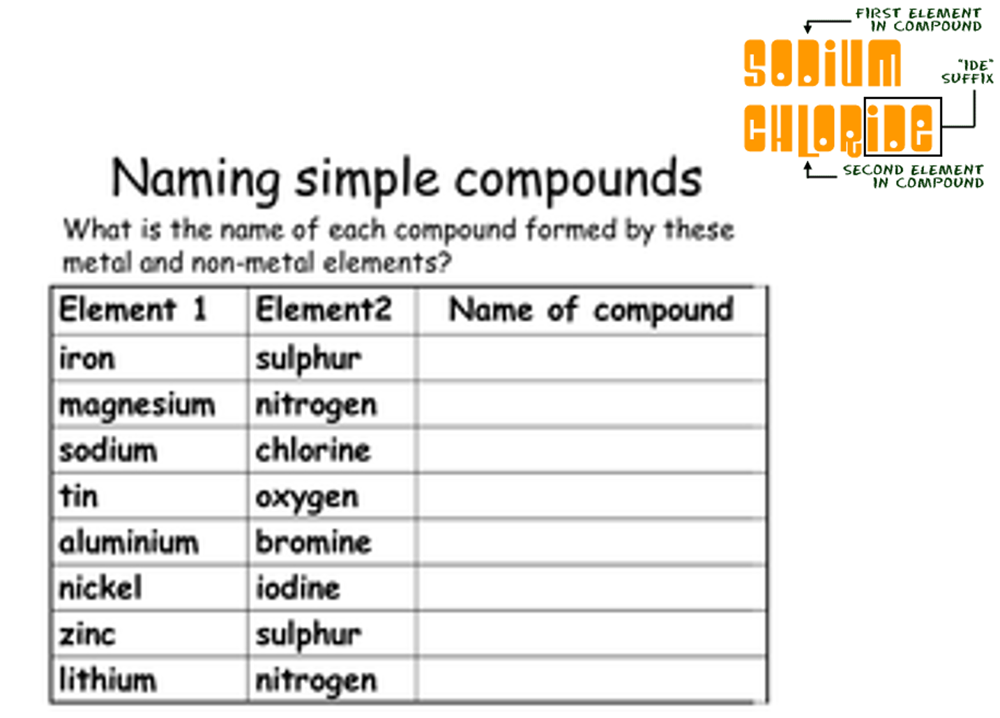

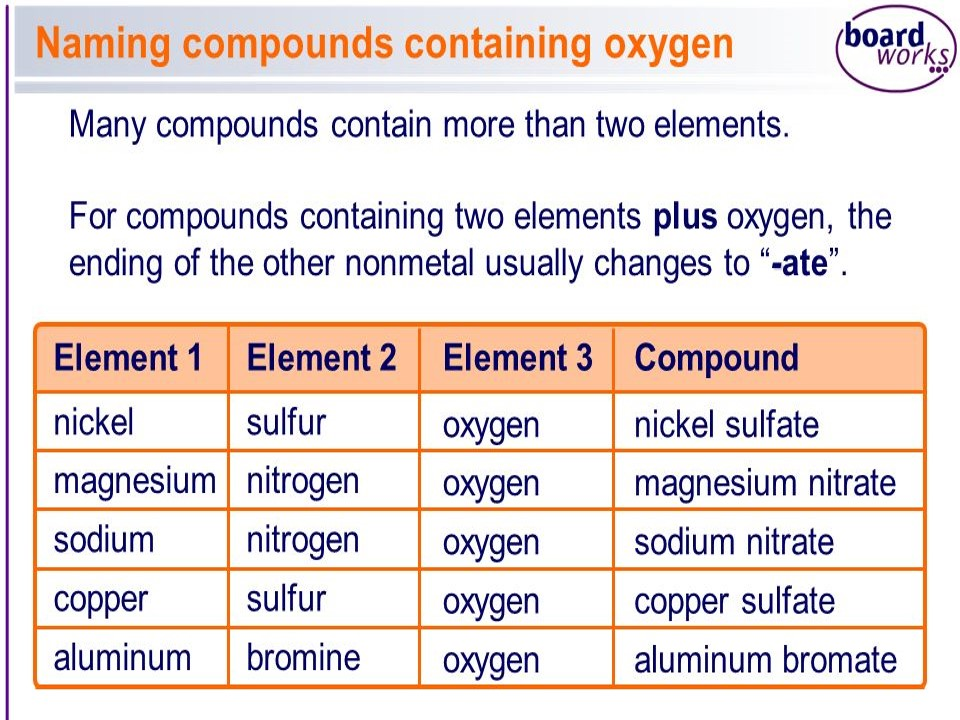

<!--StartFragment-->

Chemical reactions are represented by:

<!--EndFragment-->

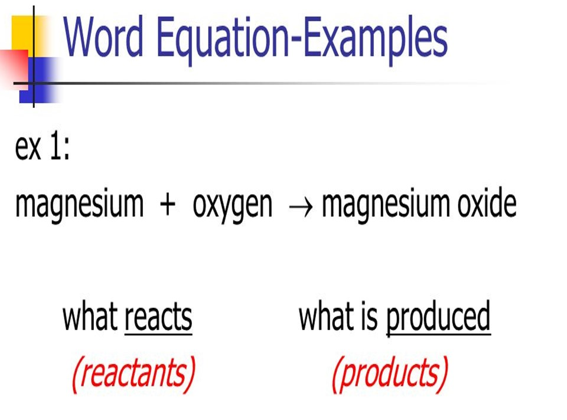

A chemical reaction takes place when compounds are formed from their elements or if a large compound breaks into smaller elements or compounds.

Thermal decomposition - When compounds form elements (heat can split a compound into its elements)

<!--EndFragment-->

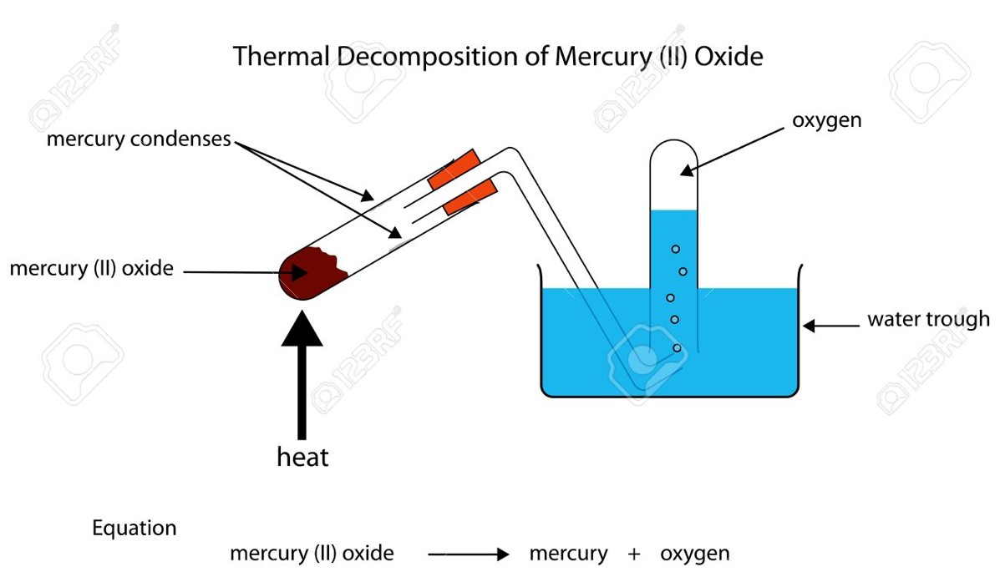

<!--StartFragment-->

Some compounds can thermally decompose  to form other compounds:

<!--EndFragment-->

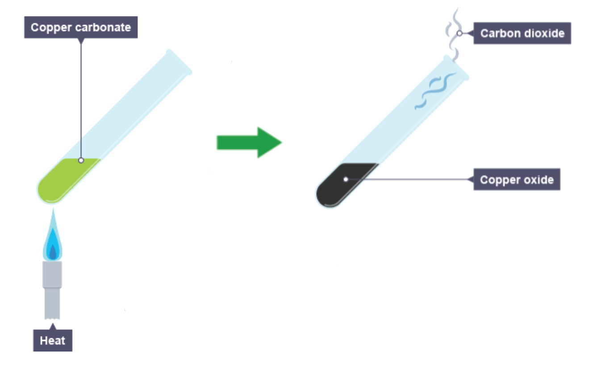

CHEMICAL REACTION signs

<!--EndFragment--><!--StartFragment-->

•Colour change

•Smell

•Bubbling (Effervescence) because a gas is given off

•Solid (precipitate) forming

•Heat given off

<!--EndFragment-->

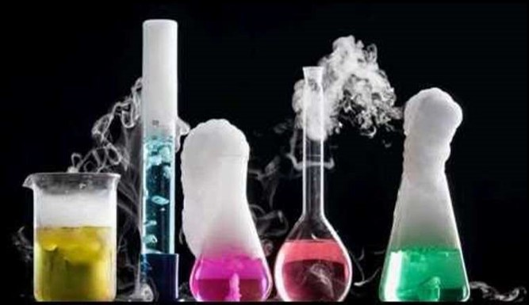

<!--StartFragment-->

<!--StartFragment-->