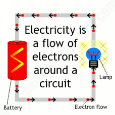

<!--StartFragment-->

An electric circuit is a path for electric charge (electrons) to flow along.

<!--EndFragment-->

# Circuit Symbols

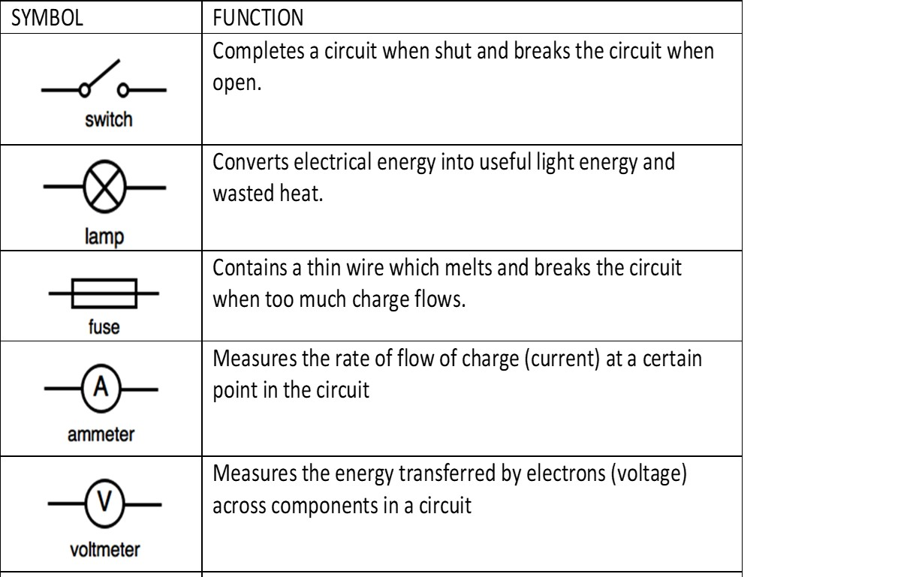

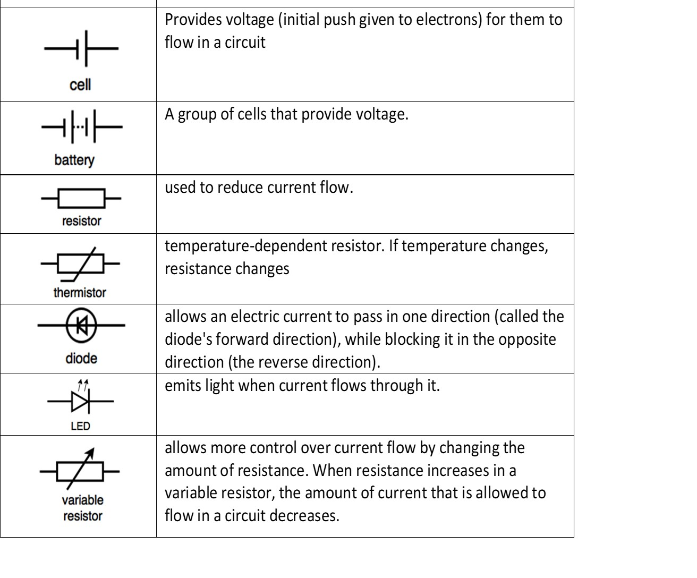

# Series and Parallel Circuits

In a series circuit, all circuit components are connected in one single loop. If one component gets damaged, the entire circuit gets broken.

In a parallel circuit, there is more than one path around the circuit. There are junctions connecting many branches or loops together in the circuit. If one component in a branch gets damaged, the other branches can still function and the entire circuit does not break. 

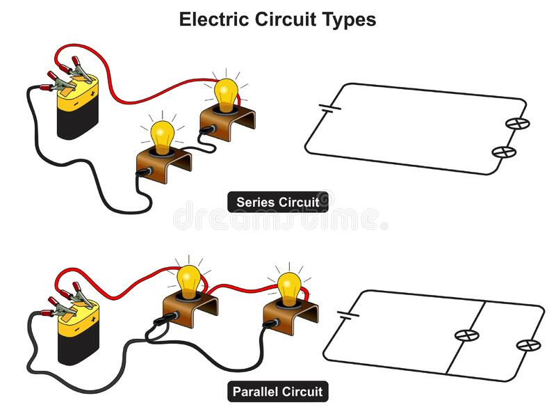

# Current

Electric current is the rate of flow of charge. It is a measure of how many electrons flow every second at a point in the circuit.  \
An ammeter measures current in a circuit. The ammeter is connected in series in the circuit. 

The units of current are Amperes or Amps

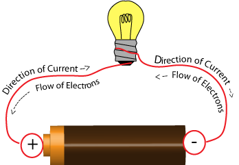

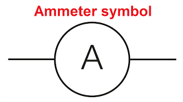

Current is the same everywhere in a series circuit.

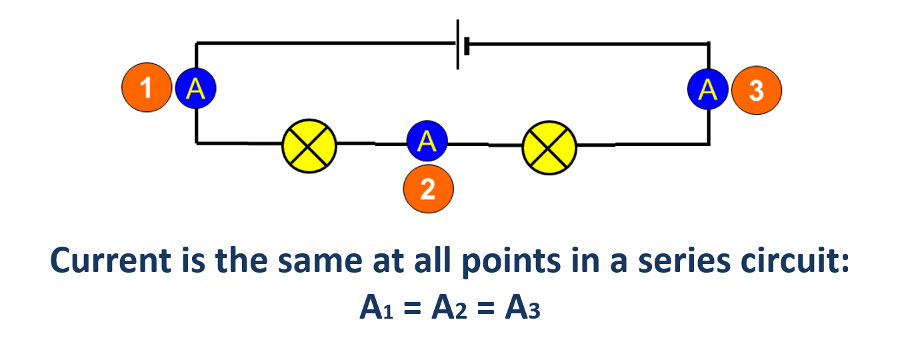

<iframe width="962" height="541" src="https://www.youtube.com/embed/zZ8znejhOas" title="Current in a series circuit" frameborder="0" allow="accelerometer; autoplay; clipboard-write; encrypted-media; gyroscope; picture-in-picture; web-share" allowfullscreen></iframe>

Current is shared across branches in a parallel circuit. The current entering the circuit is split across the branches and then is added up again so that current leaving the circuit is the same as current entering it.

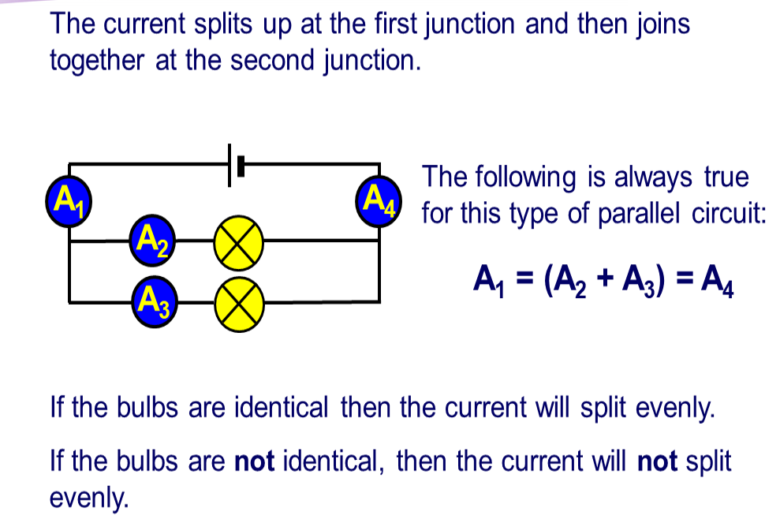

 <iframe width="962" height="541" src="https://www.youtube.com/embed/ieooOjVBmbw" title="Current in a parallel circuit" frameborder="0" allow="accelerometer; autoplay; clipboard-write; encrypted-media; gyroscope; picture-in-picture; web-share" allowfullscreen></iframe>

# Voltage

Voltage is the push given to electrons by a power source such as a cell or battery. Voltage is a measure of the energy transferred across each component in the circuit. 

Voltage is measured using a voltmeter. The units for voltage are the Volts.

In a series circuit voltage from the power source is shared by the components in the series circuit. 

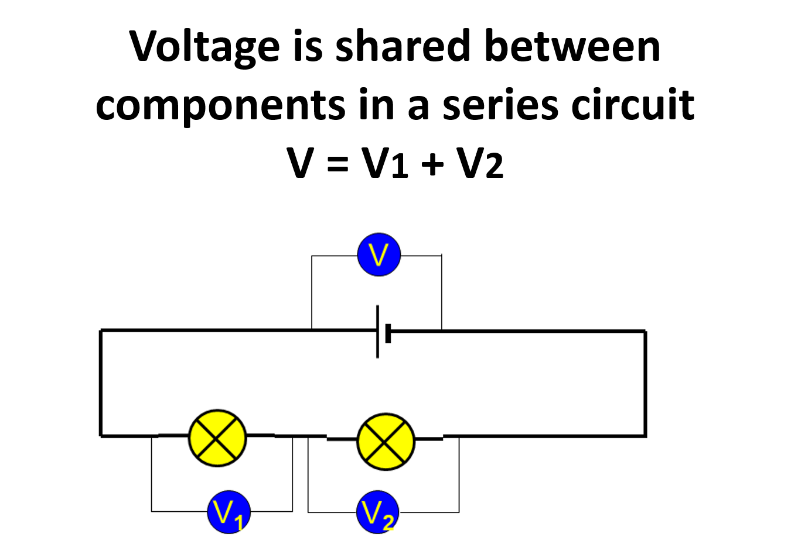

<iframe width="962" height="541" src="https://www.youtube.com/embed/Mt2rZJ9uVL0" title="Voltage in a series circuit" frameborder="0" allow="accelerometer; autoplay; clipboard-write; encrypted-media; gyroscope; picture-in-picture; web-share" allowfullscreen></iframe>

In a parallel circuit voltage is the same across each branch of the parallel circuit.

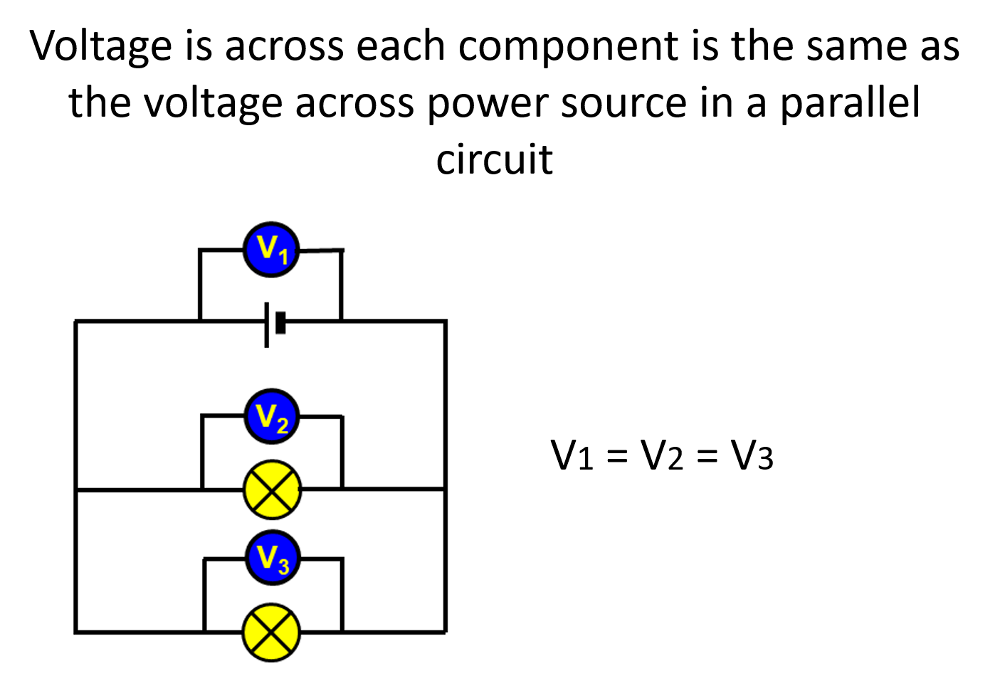

<iframe width="962" height="541" src="https://www.youtube.com/embed/etnrAWT1lY0" title="Voltage in a parallel circuit" frameborder="0" allow="accelerometer; autoplay; clipboard-write; encrypted-media; gyroscope; picture-in-picture; web-share" allowfullscreen></iframe>

# Resistance

Resistance is a measure of the opposition to the flow of electrons in a circuits. It is the prevention of current in a circuit. Resistance is measured in Ohms by an Ohmmeter. 

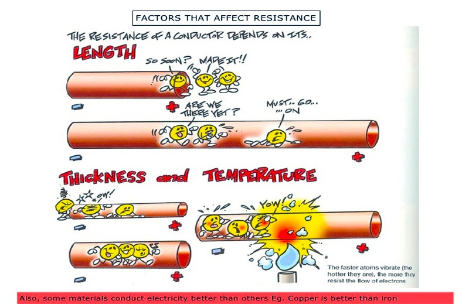

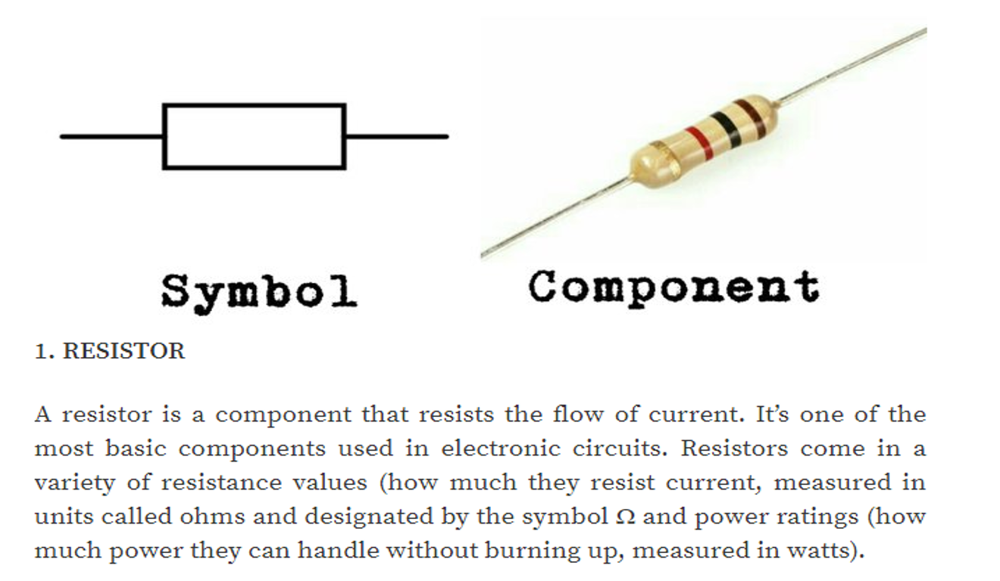

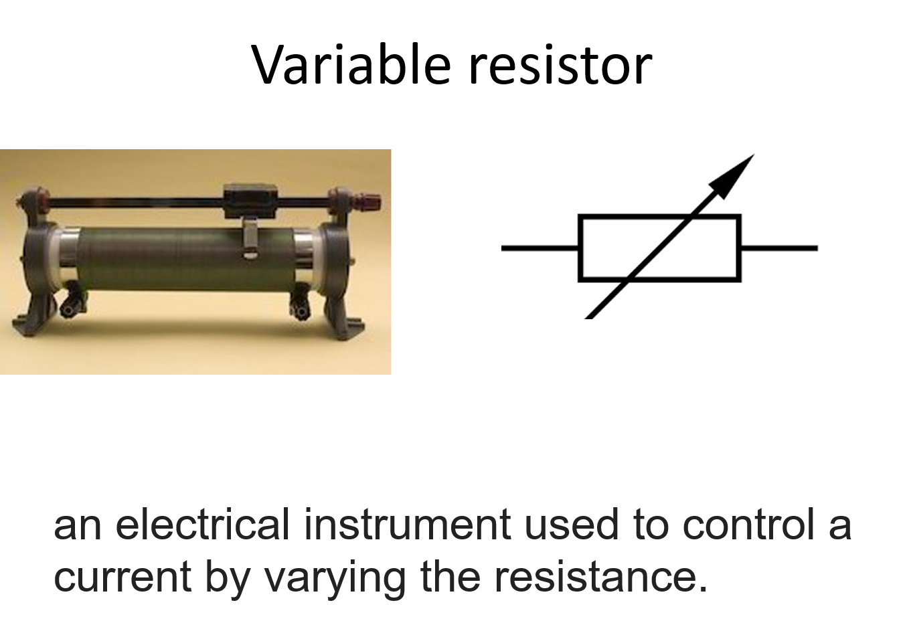

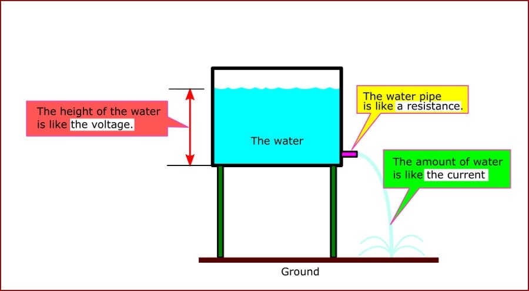

# Wires in a plug

<!--StartFragment-->

A plug connects a device to the mains electricity supply. The cable between the device and the three-pin plug contains three copper wires that are coated with plastic.

<!--EndFragment-->

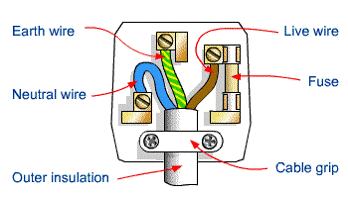

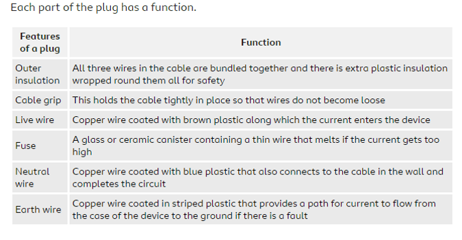

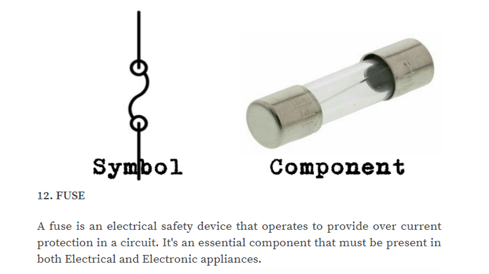

<!--StartFragment-->

# Grounding and Fuses

<!--EndFragment-->

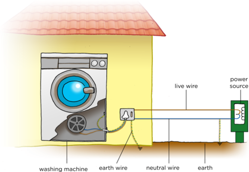

<!--StartFragment-->

•Without the earth wire, if a fault occurs and the live wire becomes loose, there is a danger that it will touch the case of an appliance. The next person who uses the appliance could get electrocuted. The earth wire is therefore connected to the case and is attached to a metal plate or water pipe underground. As the wire is made of copper, the earth wire provides a low resistance path to the ground. In the event of a fault, the live current will follow this path to the ground instead of passing through a person. However, this would generate a very large current, leading to intense heating which could start a fire, so a fuse or a circuit breaker is also included in the circuit.

•The fuse contains a thin wire that will melt if the current gets too high in a circuit. If there is a fault that causes the casing of the device to become live, a large current will flow through the live wire and low-resistance earth wire. This high current will also cause the fuse in the plug of appliance to melt.

•Once the fuse has melted, the circuit is broken and no more current flows through the device. This means the case of the device is no longer live and there is no more risk of electrocution. A circuit breaker can serve the same function as a fuse but can be reset without the need for replacement if it trips.

•The fuse or circuit breaker must be connected in the live wire side of a domestic circuit to ensure that it keeps high voltage from reaching the user, or surroundings, if a fault develops.

<!--EndFragment-->

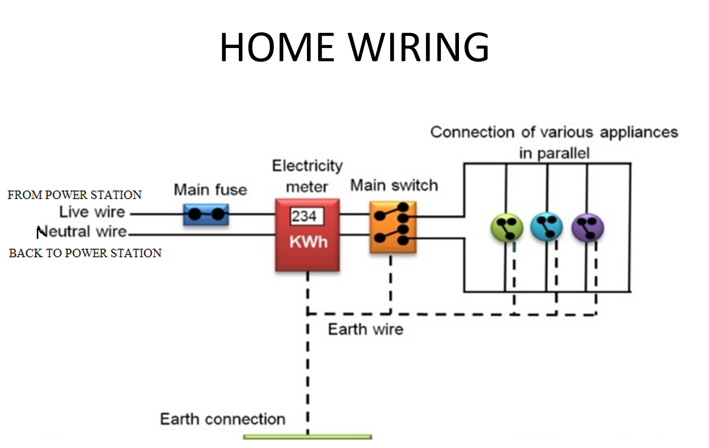