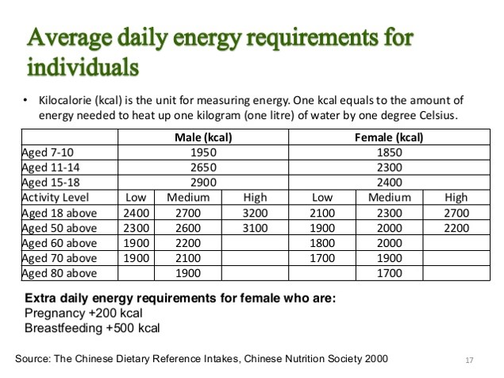
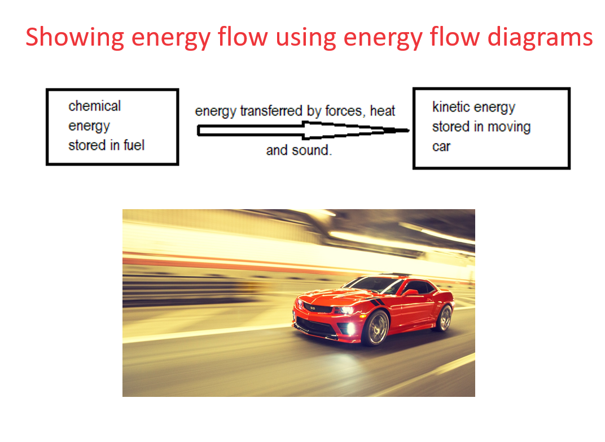
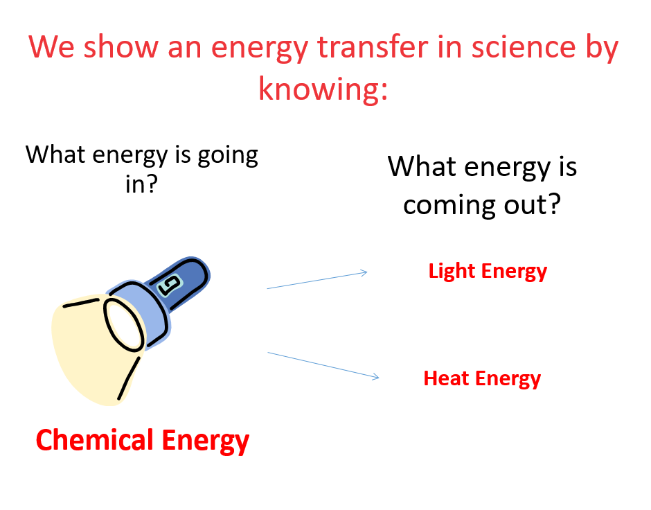

This chapter deals with the following sub-topics:

* [Energy from food](#Energyfromfood)
* [Energy Transfers & Stores](#EnergyTransfers&Stores)
* [Energy flows](#Energyflows)
* [Fuels & Energy resources](#Fuels&Energyresources)
* [Energy efficiency](#Energyefficiency)

## Energy from food

Energy is measured in Joules. 
We get energy from food.
Energy in foods is measured in kiloJoules. It is also measured in kilo Calories. 
1 kCal = 4 kJ
Different people have different energy requirements per day:

#  Energy Transfers & Stores

Energy can be stored as:

**•Chemical energy** in batteries, food and other fuels like petrol/diesel.

**•Thermal energy** in hot objects

•**Kinetic energy** in all moving objects

**•Elastic potential energy** (strain) in objects which are stretched, twisted, bent or compressed (squashed).

**•Gravitational potential energy** in objects held at high positions.

**•Nuclear** (atomic) energy inside all materials

Energy can be transferred (moved) from a store of energy) by:

**•Forces**

**•Light**

**•Electricity**

**•Sound**

**•Heating**

#### Law of Conservation Of Energy

<!--StartFragment-->

Energy cannot be created or destroyed but can only be transferred from one form to another.

<!--EndFragment-->

# Energy flows

<!--StartFragment-->

•Since energy is conserved, total energy going into the object equals to the total energy coming out from it.

<!--EndFragment-->

More examples of energy flows in:

* photovoltaic solar panels - converts light energy into electrical energy
* a greenhouse - converts light energy into t.hermal energy.
* a television - converts electrical energy into light and sound energy.
* an electric heater - converts electrical energy into heat energy
* a car - converts chemical energy into kinetic energy. 
* playing a drum - kinetic eneryg into sound energy.
* an explosion - converts chemical energy into kinetic, sound, heat and light energy.
* a torch - converts chemical energy into electrical energy into light energy. 
* a star - converts nuclear energy into heat and light energy,
* a battery charger - converts electrical energy into chemical energy.
* a tree - converts light energy into chemical energy.
* a microphone - converts sound energy into electrical energy.
* a nuclear bomb - converts nuclear energy into kinetic, sound, light and heat energy.
* a rocket - converts chemical energy into kinetic energy into gravitational potential energy. 
* a glow stick - converts chemical energy into light energy.
* a ball rolling down a slope - converts gravitational potential energy into kinetic energy.
* a generator  - converts chemical energy into kinetic energy into electrical energy.
* shooting an arrow from a bow - converts elastic potential energy into kinetic energy.
* a clockwork toy - converts elastic potential energy into kinetic energy.
* a hot air balloon - converts chemical energy into heat energy into gravitational potential energy.
* a light mill - converts light energy into kinetic energy.
* a wind farm - converts kinetic energy into electrical energy.
* a pole vaulter - converts kinetic energy into elastic potential energy into gravitational potential energy.