<!--StartFragment-->

•Being fit can be defined as the ability of a body to cope with all the demands of its lifestyle.

•Fitness is made up of four factors: 4 S-factors:

<!--EndFragment-->

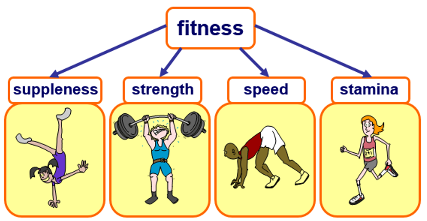

<!--StartFragment-->

# MUSCLES & BREATHING

<!--EndFragment-->

<!--StartFragment-->

•Oxygen is needed by cells to respire and release energy.

•Cells get the oxygen they need from the blood. Oxygen enters the blood in your lungs. The circulatory system carries blood carrying oxygen to each body cell.

•Respiration in cells produces carbon dioxide gas which enters blood and then leaves the blood into the lungs for it to be exhaled (excreted).

<!--EndFragment--><!--StartFragment-->

## The gas exchange system

<!--EndFragment--><!--StartFragment-->

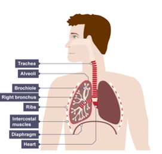

•In the lungs, oxygen enters blood and carbon dioxide leaves it. One gas is exchanged for the other and this is known as gas exchange.

<!--EndFragment-->

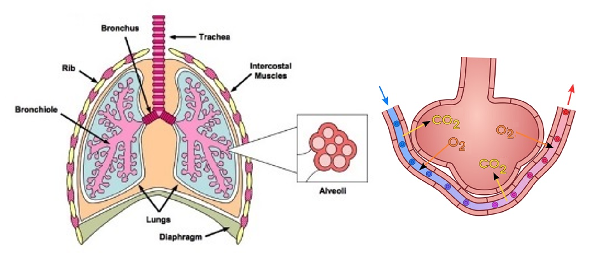

<!--StartFragment-->

BREATHING

<!--EndFragment-->

<!--StartFragment-->

•Breathing involves muscles of the diaphragm and muscles between the ribs changing the size of the lungs.

•Muscles are made of nerve tissue and muscle tissue.

•Muscle tissue is made from muscle cells which can contract and relax.

<!--EndFragment--><!--StartFragment-->

•When you inhale, rib muscles and the diaphragm contract to increase size of the lungs for air to flow in them.

<!--EndFragment-->

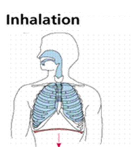

<!--StartFragment-->

•When you exhale, rib muscles and the diaphragm relax to reduce the size of the lungs for air to flow out of them.

<!--EndFragment-->

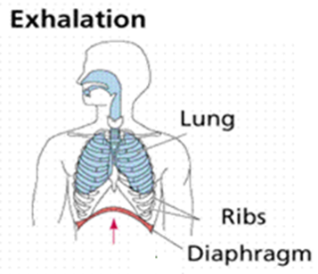

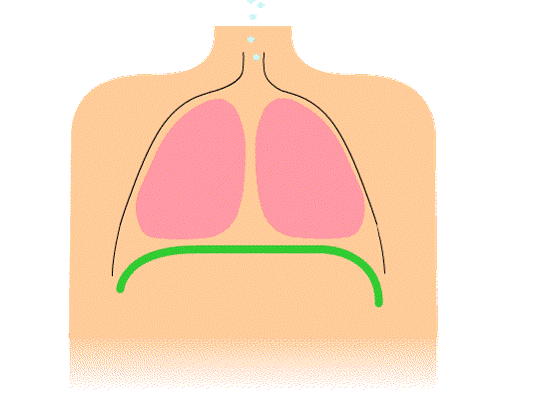

<!--StartFragment-->

## Muscles & Blood

<!--EndFragment--><!--StartFragment-->

•Each time your heart pumps blood it causes a pulse. The pulse rate is the number of pulse beats you can feel in a minute.

•Fitter people have lower pulse rates than unfit people when resting. Most people have pulse rates of between 60 to 100 beats per minute. Fit athletes have pulse rates below 50 beats per minute.

•The left side of the heart has much more muscle than the right. Muscle tissue in the heart contracts to push blood through the heart and into blood vessel called arteries.

•Arteries lead into tiny blood vessels called capillaries which have very thin walls made up of very thin, flat cells so that nutrients (from food) and oxygen can leave the blood and get into cells for respiration and growth. The capillary walls keep large structures such as red blood cells inside the capillary. Other substances such as oxygen, carbon dioxide, glucose (sugar), and water can pass through.

•The blood then picks up waste materials from cells as it travels through capillaries and then into veins which carry blood back to the heart. 

<!--EndFragment-->

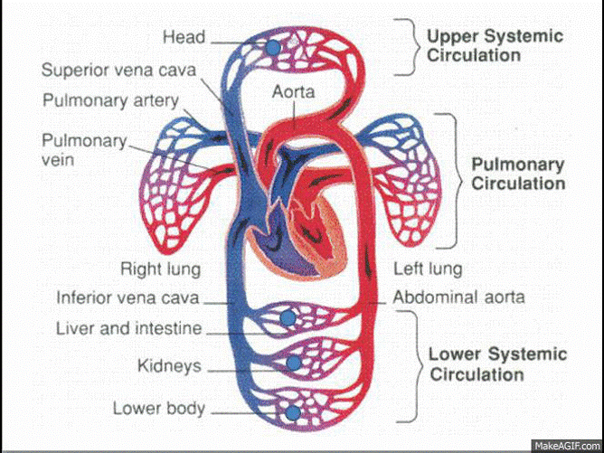

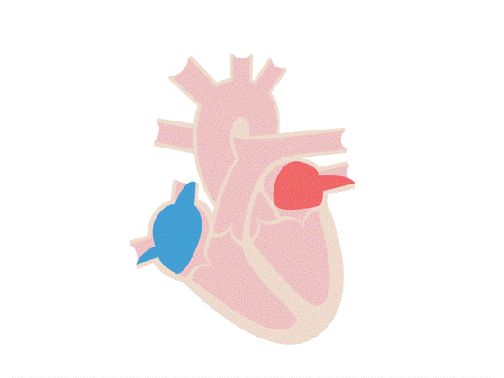

<!--StartFragment-->

When the heart pushes blood into the aorta, the blood's impact on the elastic walls creates a pressure wave that continues along the arteries. This impact is the pulse.

<!--EndFragment--><!--StartFragment-->

The normal breathing rate of 12-18yr olds is 12 to 16 breaths per minutes. (One complete breath comprises one inhalation when the chest rises, followed by one exhalation when the chest falls. To measure the breathing rate, count the number of breaths for an entire minute or count for 30 seconds and multiply that number by two.)

The normal heart rate of 12-18yr olds is 60 and 100 beats per minute. With activity, the heart rate may get as high as 200 beats per minute. (When you feel your pulse, count the number of beats in 15 seconds. Multiply this number by four to calculate your beats per minute.)

<!--EndFragment-->

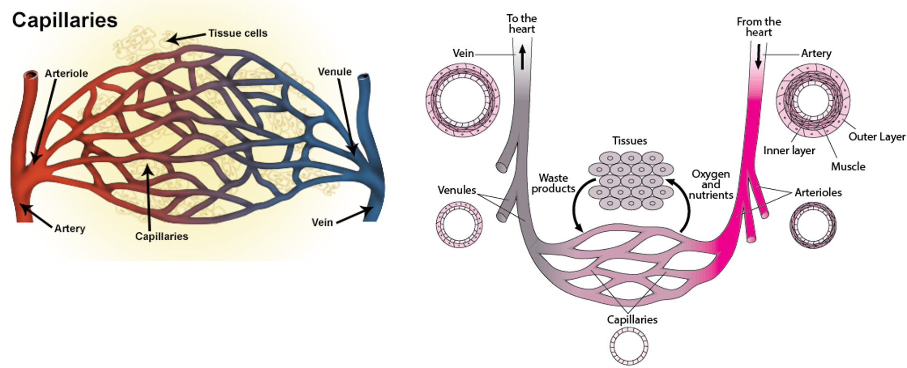

<!--StartFragment-->

The walls of capillaries are made up of very thin, flat cells. The capillary walls keep large structures such as red blood cells inside the capillary. Other substances such as oxygen, carbon dioxide, glucose (sugar), and water can pass through.

<!--EndFragment-->

<!--StartFragment-->

### BLOOD

<!--EndFragment-->

<!--StartFragment-->

•The liquid part of blood is called Plasma. Plasma contains dissolved nutrients and waste which are carried by blood.

•Blood contains Red blood cells which carry oxygen. Copy FACT pg 43

Adaptation:

1.They don’t have a nucleus so the cytoplasm can pack hemoglobin which is where oxygen is carried.

2.The cells have a curved disc shape which gives them a large surface area for oxygen to quickly get in and out of them.

•Blood also contains white blood cells to fight infections and keep you healthy.

Red blood cells and white blood cells are made in the bone marrow tissue in bones.

<!--EndFragment-->

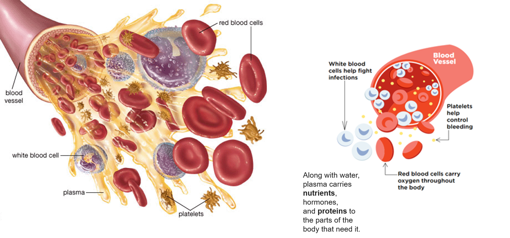

<!--StartFragment-->

# THE SKELETON

<!--EndFragment-->

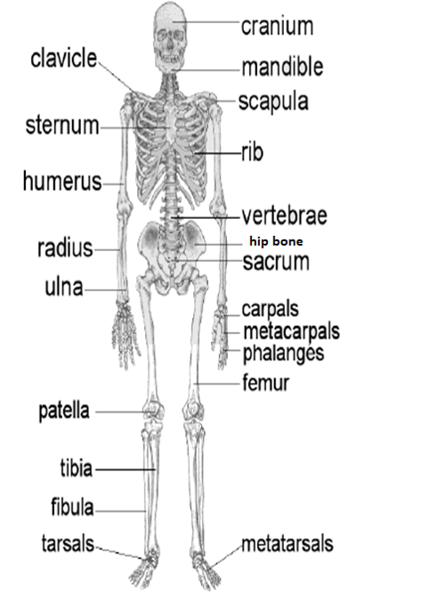

<!--StartFragment-->

Bones are hard, strong (to withstand pressure) and light (can be moved easily). They are living organs containing the following tissue:

•Cartilage tissue – flexible but resists stretching

•Osteoblast tissue – bone making cells called osteoblasts make compact bone and spongy bone

•Bone marrow tissue – reduces mass of bone and makes blood cells.

<!--EndFragment-->

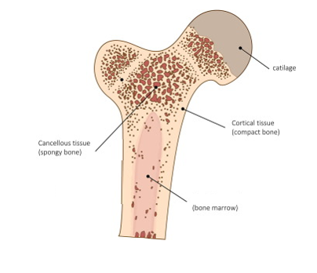

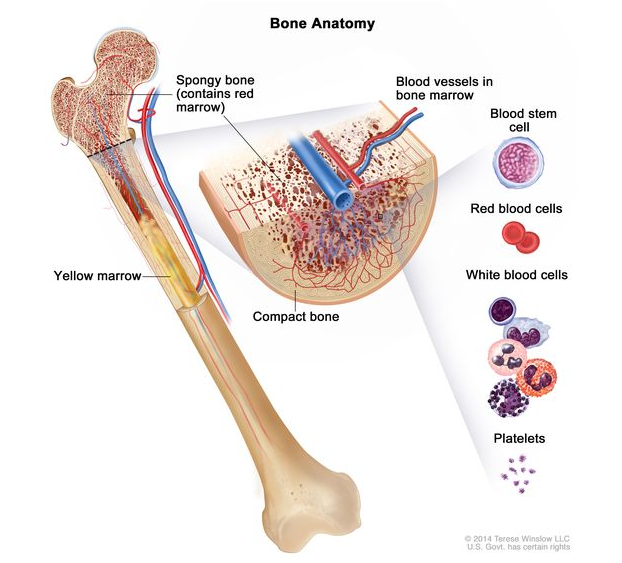

<!--StartFragment-->

*FUNCTIONS OF THE SKELETON*

<!--EndFragment-->

<!--StartFragment-->

* •Support -The human body’s main support is the backbone made up of smaller bones called the Vertebrae. Bones like the ribcage help support internal organ
* •Protection – Bones protect internal organs e.g the skull protecting the brain from injury
* Movement –

•Two bones next to each other can form a joint.

Types of Joint:

•Fixed joint – where bones meet but cannot move e.g. in the skull

•Flexible Joint – where bones can be moved by muscles. The muscles are attached to the bones by tendons. Ligaments hold the two bones together. Cartilage is a slippery tissue that can allow the two bones to slide past each other.

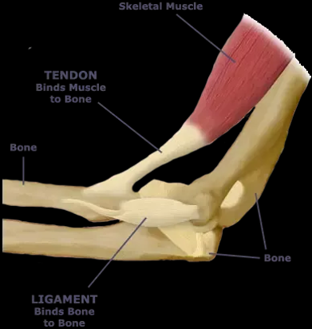

<!--EndFragment--><!--StartFragment-->

Flexible joints include:

Hinge joint – e.g elbows & knees

Ball and Socket joint e.g. Hips & shoulders

<!--EndFragment-->

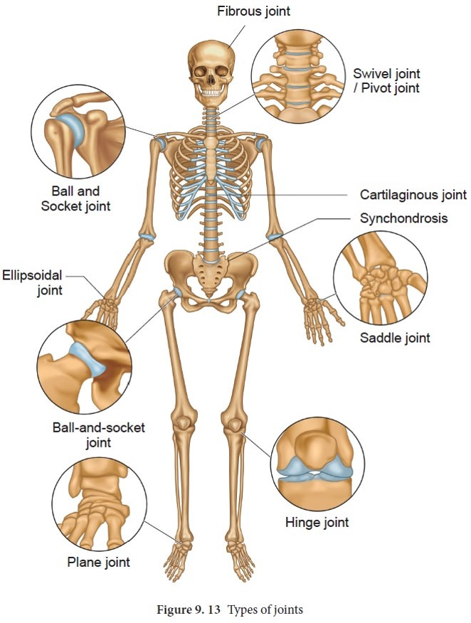

<!--StartFragment-->

## Muscles and Moving

<!--EndFragment-->

<!--StartFragment-->

The muscles and bones form the locomotor organ system which allows you to move the parts of your body. Biomechanics is the study of how muscles and bones work together.

Thicker bones are needed to support bigger muscles.

<!--EndFragment-->

<!--StartFragment-->

**ANTAGONISTIC MUSCLES**

<!--EndFragment-->

A muscle can only pull on a bone and not push back on it. So in order to lift *and* lower a bone, it needs two separate muscles that are antagonistic to each other - which means if one contracts to lift the bone, the other relaxes.  

E.g. To lift the lower arm bone, biceps muscles contract and the triceps muscles relax. To lower the arm bone back, the triceps contract while the biceps relax. Therefore biceps and triceps are an antagonistic muscle pair.

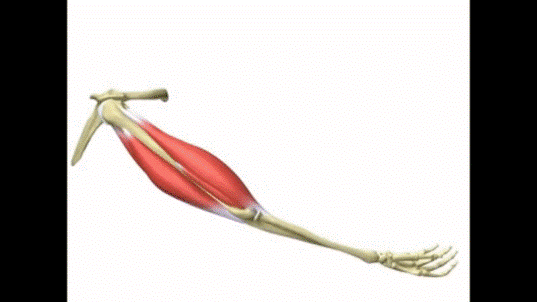

Other examples of antagonistic muscle pairs in the body are:

* wrist flexor and wrist extensor to move the wrist bone
* calf and shin muscles to move the foot
* biceps femoris and quadriceps to move the lower leg.

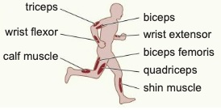

<!--StartFragment-->

# DRUGS 

A drug is a substance that affects/changes the way your body works.

<!--StartFragment-->

Types of Drugs:

<!--EndFragment-->

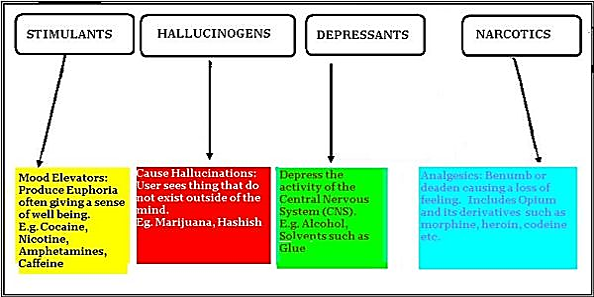

<!--StartFragment-->

**Medicinal Drugs**

<!--StartFragment-->

These types of drugs help people fight diseases and recover from injuries.

Examples include:

* Paracetamol that reduces swelling
* Ibuprofen which reduces pain and swelling
* Decongestants to help recover from flu by helping you breathe easily e.g. Salbutamol is used to treat asthma by relaxing airway muscles and decongesting them making it easier to breathe.
* Antibiotics to kill bacteria in bacterial infections
* Antivirals to fight virus related infections
* Antifungals to kill fungi infections

Although these drugs are useful they may have harmful side effects e.g most drugs can damage the liver whose job is to break drugs down in the body.

<!--EndFragment-->

<!--EndFragment--><!--StartFragment-->

**Recreational drugs** -

<!--EndFragment--><!--StartFragment-->

* Legal recreational drugs – Caffeine (stimulant), nicotine (stimulant) and alcohol(depressant).
* Illegal recreational drugs – Cannabis (cause memory loss and mental illness), Ecstasy (a stimulant causing mental illness, kidney problems and even death), Cocaine (a stimulant which blocks arteries), Heroin (a depressant causing collapses veins, vomiting and severe headaches) 

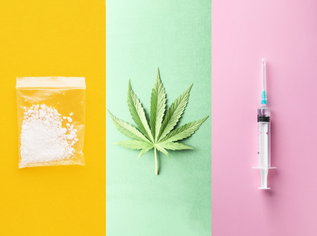

**Substance Misuse** – is the harmful use of drugs.

<!--EndFragment--><!--StartFragment-->

•Drugs can become addictive which means people feel like they can’t live without them. Addicts are people who are addicted to drugs and keep using them even though the drugs cause them harm.

•Overdoses of drugs can lead to death.

•Overuse of steroids (medicinal drugs that work like hormones) can cause drastic changes in a person’s body.

<!--EndFragment-->

<!--EndFragment-->