<!--StartFragment-->

•A force is a push or pull on a body.

•Force causes motion: change in speed, direction, shape or size.

•SI Unit of Force: Newton :  N

<!--EndFragment--><!--StartFragment-->

Types of forces:

•Contact Force -  force between objects that are touching each other. e.g friction, upthrust , reaction force 

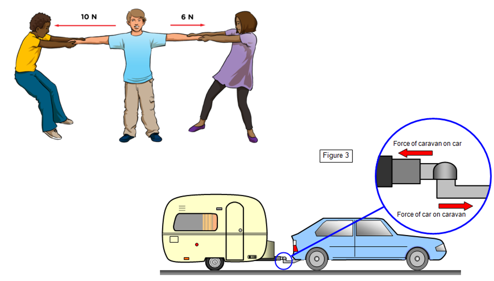

•Non Contact Forces -force between objects that are not touching each other e.g gravitational, magnetic and electrostatic forces

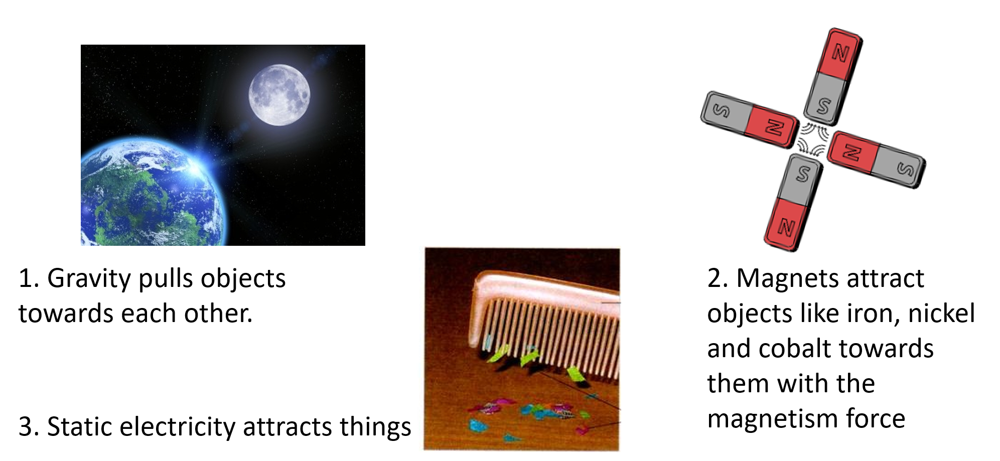

<!--StartFragment-->

# **Friction** 

Friction acts to slow objects down. Friction is the force opposing motion. It produces heat.

<!--EndFragment-->

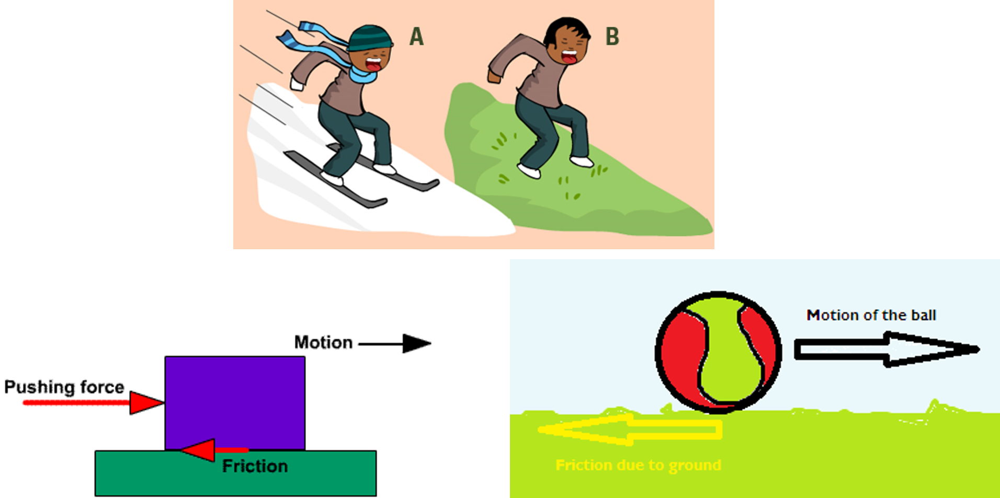

<!--StartFragment-->

How is friction reduced?

<!--EndFragment--><!--StartFragment-->

•By lubrication -Using a lubricant – such as oil or grease

•Making the surface smoother

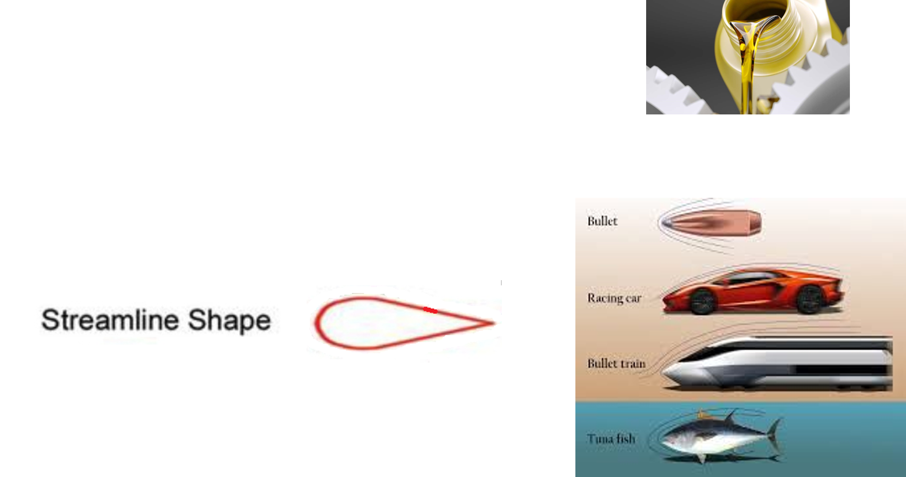

•Streamlined shape to reduce air resistance or water resistance.

<!--EndFragment-->

<!--StartFragment-->

# **Air Resistance (drag force)**

Air reistance is an opposing force slowing down objects moving through air.

<!--EndFragment-->

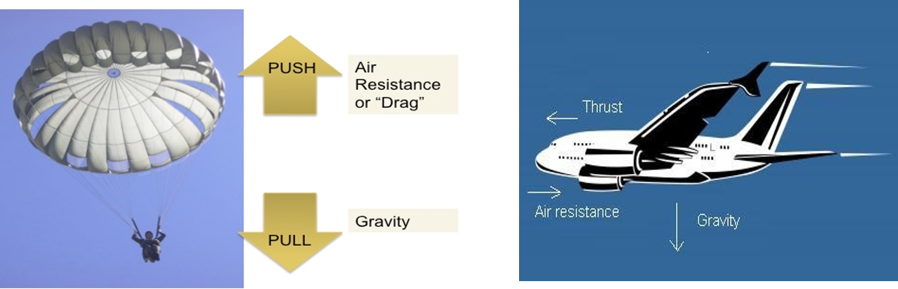

<!--StartFragment-->

Reduce air resistance on a body by making the body have a  streamlined shape:

<!--EndFragment-->

<!--StartFragment-->

# Water resistance

Water resistance is an opposing force slowing down objects moving through water. It can be reduced by making the object have a streamlined shape and lubricating it.

<!--EndFragment-->

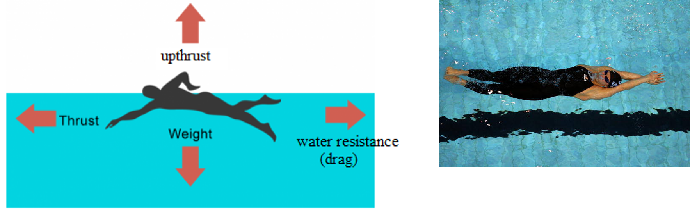

<!--StartFragment-->

# Upthrust

Upthrust is the force that makes things float. It acts opposite to weight.

<!--EndFragment-->

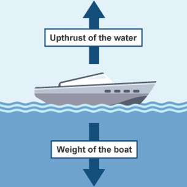

<!--StartFragment-->

# Weight

Weight is the force of gravity acting on an object with mass.

<!--EndFragment--><!--StartFragment-->

Your weight is determined by your mass and the gravitational field strength of Earth.

Every 1kg of mass on Earth is pulled with a force of 10N towards the center of the Earth. The gravitational force is therefore 10N/kg. (10N per kg).

So a 50kg weight would be pulled towards Earth with a force of 500N:

 1kg : 10N

50kg : (50x10)/1 = 500N

Therefore:

<!--EndFragment--><!--StartFragment-->

Weight (N) = Mass (kg) x Gravitational force per every 1kg of mass (N/kg)

<!--EndFragment-->

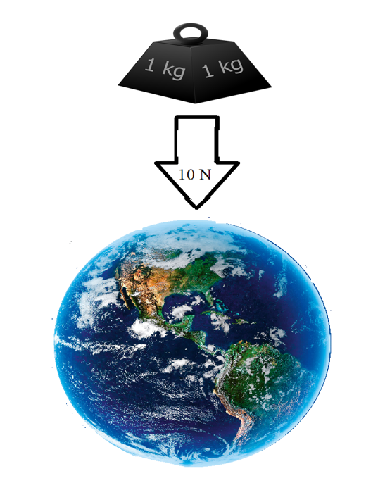

<!--StartFragment-->

The triangle below shows the relationship between weight, mass and gravity:

<!--EndFragment-->

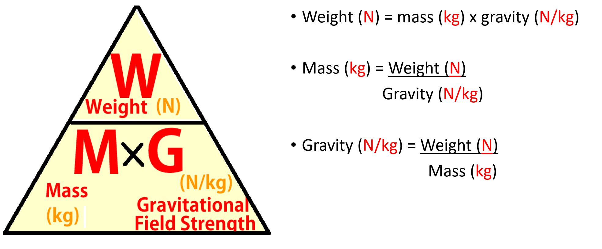

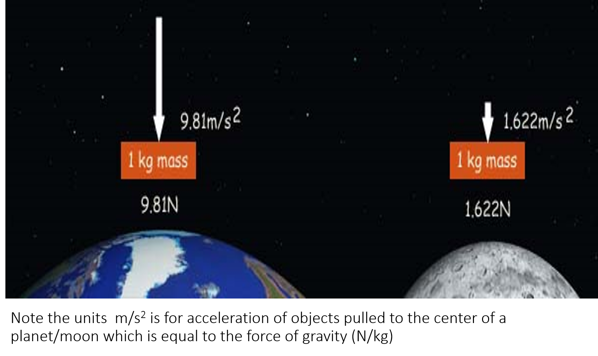

<!--StartFragment-->

The gravitational field strength on the moon is about 2N/kg so weight on the moon will be less than on Earth.

<!--EndFragment-->

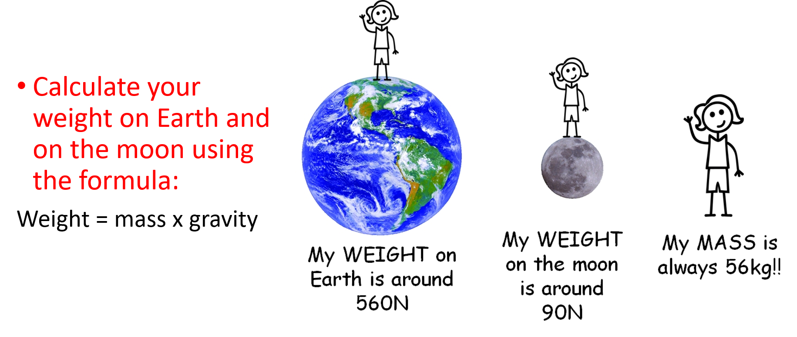

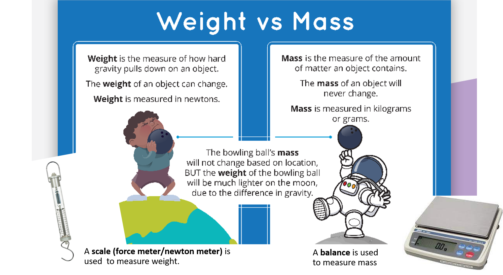