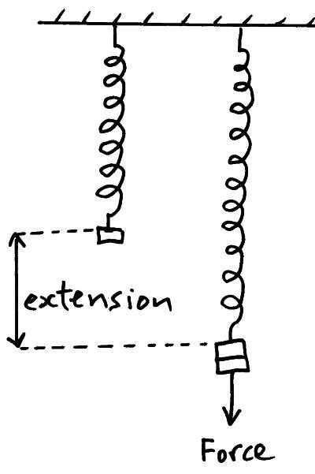
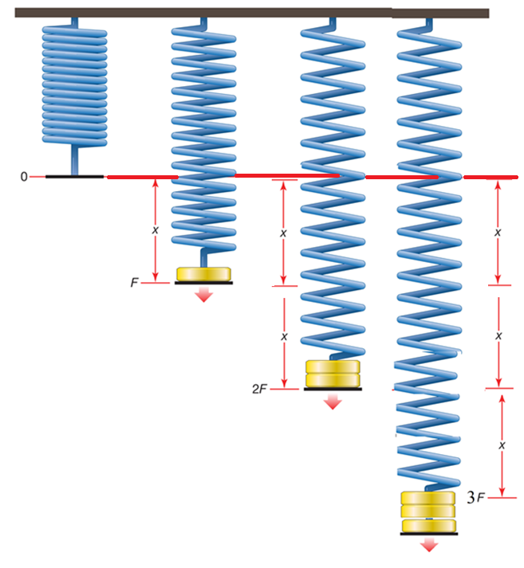
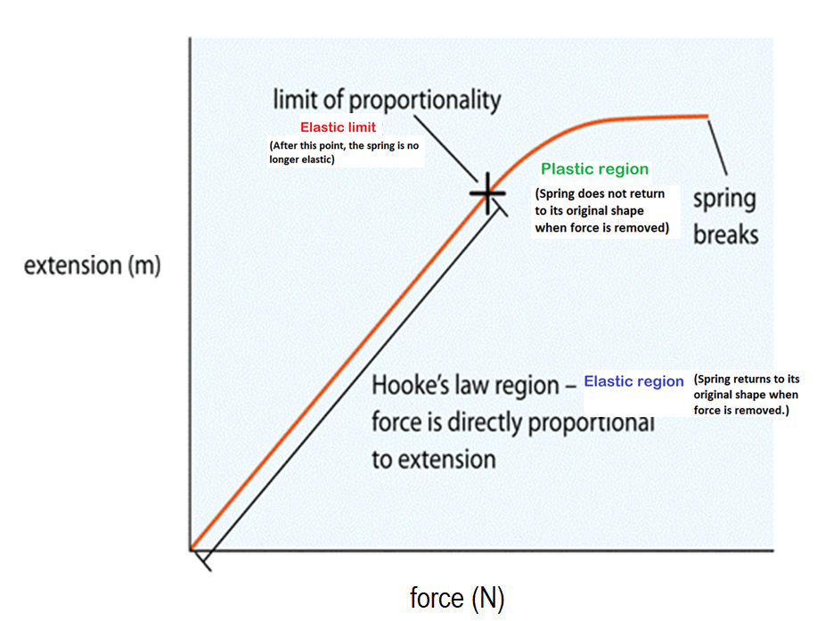
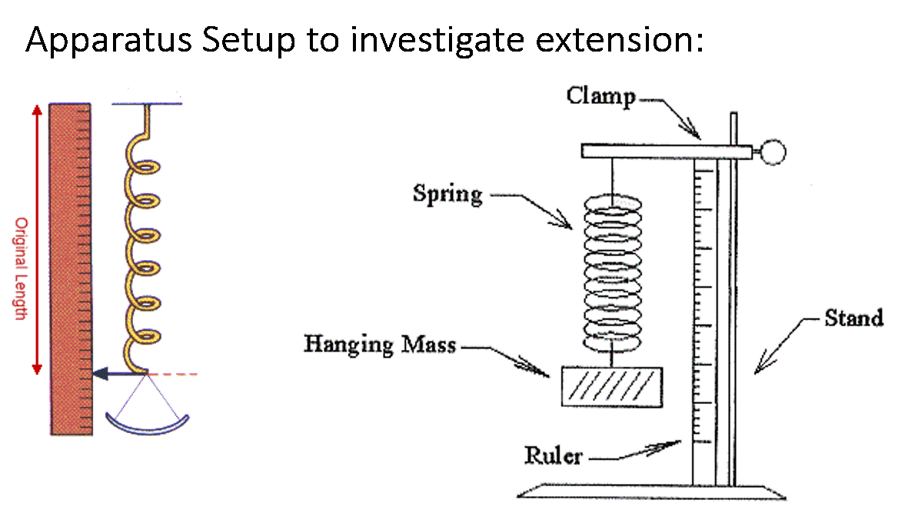
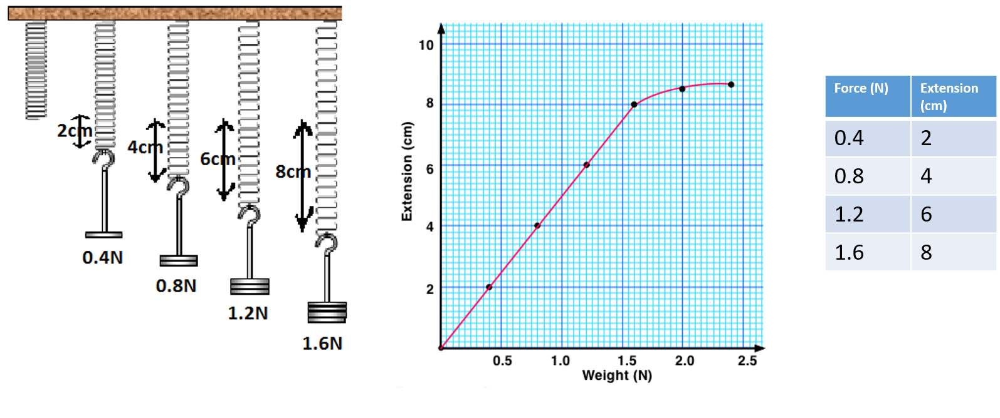
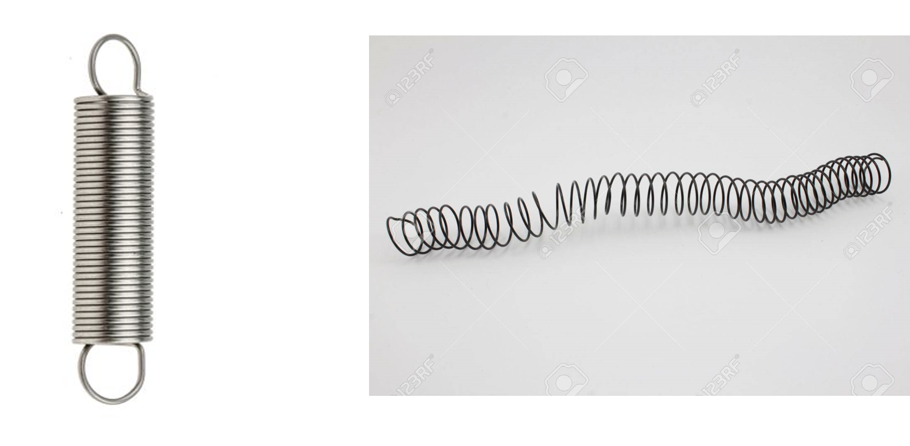

<!--StartFragment-->

•A force is a push or pull on a body.

•Force causes motion: change in speed, direction, shape or size.

•SI Unit of Force: Newton :  N

<!--EndFragment--><!--StartFragment-->

**Types of forces:**

•Contact Force -  force between objects that are touching each other. e.g friction, upthrust , reaction force 

•Non Contact Forces -force between objects that are not touching each other e.g gravitational, magnetic and electrostatic forces

<!--StartFragment-->

# **Friction** 

Friction acts to slow objects down. Friction is the force opposing motion. It produces heat.

<!--EndFragment-->

<!--StartFragment-->

How is friction reduced?

<!--EndFragment--><!--StartFragment-->

•By lubrication -Using a lubricant – such as oil or grease

•Making the surface smoother

•Streamlined shape to reduce air resistance or water resistance.

<!--EndFragment-->

<!--StartFragment-->

# **Air Resistance (drag force)**

Air reistance is an opposing force slowing down objects moving through air.

<!--EndFragment-->

<!--StartFragment-->

Reduce air resistance on a body by making the body have a  streamlined shape:

<!--EndFragment-->

<!--StartFragment-->

# Water resistance

Water resistance is an opposing force slowing down objects moving through water. It can be reduced by making the object have a streamlined shape and lubricating it.

<!--EndFragment-->

<!--StartFragment-->

# Upthrust

Upthrust is the force that makes things float. It acts opposite to weight.

<!--EndFragment-->

<!--StartFragment-->

# Weight

Weight is the force of gravity acting on an object with mass.

<!--EndFragment--><!--StartFragment-->

Your weight is determined by your mass and the gravitational field strength of Earth.

Every 1kg of mass on Earth is pulled with a force of 10N towards the center of the Earth. The gravitational force is therefore 10N/kg. (10N per kg).

So a 50kg weight would be pulled towards Earth with a force of 500N:

 1kg : 10N

50kg : (50x10)/1 = 500N

Therefore:

<!--EndFragment--><!--StartFragment-->

Weight (N) = Mass (kg) x Gravitational force per every 1kg of mass (N/kg)

<!--EndFragment-->

<!--StartFragment-->

The triangle below shows the relationship between weight, mass and gravity:

<!--EndFragment-->

<!--StartFragment-->

The gravitational field strength on the moon is about 2N/kg so weight on the moon will be less than on Earth.

<!--EndFragment-->

<!--StartFragment-->

## The force meter – used to measure Force (weight)

Springs are used inside force meters that are used to measure weights of certain masses.

If the meter is measuring a small weight, the spring stretches by a small amount. If the meter is measuring a large weight, it stretches by a larger amount.

Most force meters have a force limit to them so weights exceeding that limit cannot be measured using them.

<!--StartFragment-->

### Extension and Springs

<!--StartFragment-->

•When a force / weight is applied on some materials, it can cause them to stretch or compress leading to an extension (a change in length from original length of spring)

•Springs extend when weights are placed on them. With springs, the extension is proportional to the force up to a certain point after which the spring can permanently get deformed or even snap. This was known as Hooke’s law.

<!--EndFragment-->

<!--StartFragment-->

Hooke’s law states: Extension of a spring is directly proportional to the force until the elastic limit (or limit of proportionality) is reached.

This means that with every increase in force applied to the spring, the extension will increase by the same amount up to a certain point after which the spring can snap or lose its elasticity.

<!--EndFragment-->

<!--StartFragment-->

The spring stretches by the same amount (x) as you keep increasing the amount of force (F) steadily on the spring.\
\
So Hooke’s law: force is directly proportional to extension means: Doubling force, doubles extension; tripling the force, triples extension)

<!--EndFragment-->

<!--StartFragment-->

There’s a limit to the amount of force a spring can withstand. When this elastic limit is passed, the spring gets deformed and Hooke’s law no longer works which means with increase in force, the extension will not be the same. 

<!--EndFragment-->

<!--StartFragment-->

##### Investigating Hooke’s law: Force is proportional to extension until elastic limit is reached.

With every 0.4N of force, the extension increases constantly by 2cm. The spring is obeying Hooke’s law.

Elastic limit/ Limit of proportionality is at 1.6N. When force added is greater than 1.6N the extension does not increase constantly.

After elastic limit the spring does not return to its original shape.

<!--EndFragment-->

