This chapter deals with the following subtopics:

* [Types of Mixtures](#Typesofmixtures)
* [Filtration](#Filtration)
* [Solutions & Solubility](#Solutions&Solubility)
* [Evaporation & Heating to dryness](#Evaporation&Heatingtodryness)
* [Chromatography](#Chromatography)
* [Distillation](#Distillation)

Matter mainly exists as a mixture. 

A mixture is made up of two or more components physically intermixed. 

##  Types of Mixtures

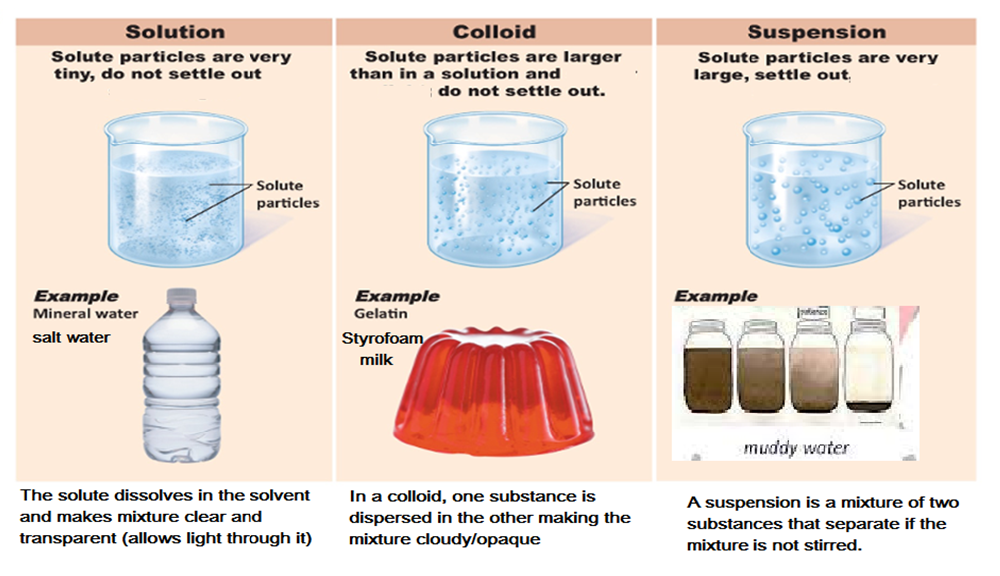

<!--StartFragment-->

75% of the Earth is water in which many different substances can dissolve making it become a solution

Water in rivers and streams may also carry solids such as sand, gravel or mud making it a colloid and suspension.

To make water safe for drinking it must be treated in different ways to remove the unwanted substances mixed in it.

<!--EndFragment--><!--StartFragment-->

1. In the first stage of water treatment, waste water (from homes, offices and street drains) passes through a screen, which acts as a sieve to remove large solids such as leaves, rubbish and lumps of human waste, as well as smaller solids. 

<!--EndFragment--><!--StartFragment-->

2: It is then  passed through fine filters and left to stand in large ‘settlement ponds’. This stage removes smaller suspended solids that eventually settle out when the water is still.

3: The water from the settlement ponds is still not clean because very small solids are still dispersed in it. Special substances (coagulants) are added to make these solids clump together. They are then easily separated from the water.

<!--EndFragment--><!--StartFragment-->

4: Disease-causing microorganisms are too small to be removed by filters or settlement ponds. Drinking water may be treated with chlorine to kill them.

<!--EndFragment-->

#  Filtration

Filtration is a method used to separate an insoluble solid from a liquid or solution. 

The substance from the mixture that is filtered out is called the **filtrate**. The substance that remains behind in the filter paper is called the **residue**.

<!--EndFragment-->

Apparatus:

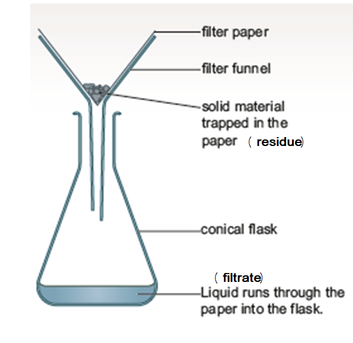

Method:

A. Fold a circular filter paper in half.

B. Fold the filter paper in half again to form a triangle shape. 

C. Open out one layer of the paper to form a cone.

D. Place the filter paper cone into a filter funnel.

E. Place the filter funnel into teh neck of a conical flask.

F. Stir the sand and water mixture so that all the sand is suspended in the water. 

G. Pour the sand and water mixture into the filter paper. 

## **SOLUTIONS**

•Substances that can dissolve in a liquid form solutions. In solutions the dissolved substance breaks up into pieces so small that light can pass straight through the mixture.

•A substance that can dissolve in a certain liquid is said to be soluble. Substances that do not dissolve in a certain liquid is said to be insoluble.

**solute + solvent = solution**

•A solute is the soluble substance

•A solvent is the liquid which is dissolving the solute.

Mass of the solution is the same as the mass of solute plus the mass of solvent at the start. No extra mass is gained or lost. This is known as the law of conservation of mass,

Total mass of the solution = mass of solute + mass of solvent

Salt water solution contains salt as the solute and water as the solvent. 

Water dissolves substances from the rocks and soil that it passes through. Water is a very good solvent because many solids, some gases and other liquids can be soluble in it.

•Solids that are soluble (i.e. can dissolve) in water – salt, sugar, coffee

•Solids that are insoluble (i.e. cannot dissolve) in water – sand, flour etc.

•Liquids that are soluble in water – alcohol; acids, alkalis

•Liquids that are insoluble in water – oils, petrol, gasoline, turpentine

•All gases have a certain degree of solubility in water. Some gases like ammonia, bromine, hydrogen chloride and sulphur dioxide are more soluble than oxygen and nitrogen.

•Those solutes that are insoluble in water can be soluble in solvents like ethanol and propanone (acetone).

<!--StartFragment-->

•There is a limit to how much solute you can dissolve in a particular volume of solvent. If the solubility limit is exceeded, the solution becomes **saturated**.

•In a saturated solution, the extra solute will sink to the bottom and stay undissolved.

**SOLUBILITY**

•The solubility of a solute is the mass that will dissolve in 100g of a solvent.

•Factors affecting solubility include:

1.Temperature – the higher the temperature, the more the solubility

2.Type of solvent - 36g of sodium chloride can dissolve in water but only 0.1g can dissolve in ethanol at 20°C

3.Stirring increases speed of solubility

<!--EndFragment-->

# Heating to Dryness

<!--StartFragment-->

Heating a solution until all the solvent has evaporated is known as heating to dryness. We use this methd to separate out a solute from a solution.

<!--EndFragment-->

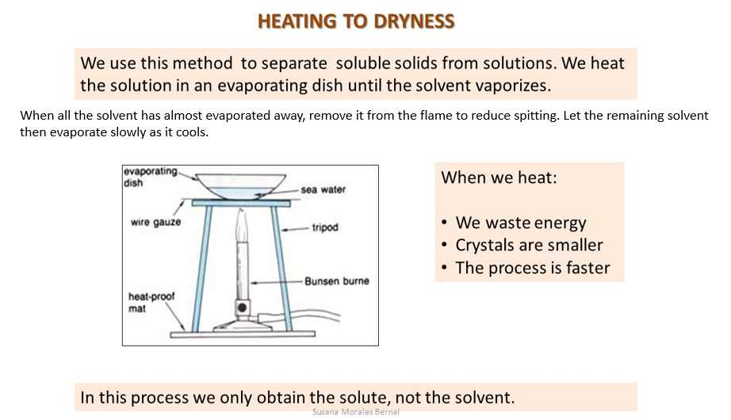

Method:

A. Use a medium flame to heat the solution. 

B. Wear eye protection while heating to prevent eyes getting burnt from spitting of the solution during heating.

C. Do not fill evaporating dish more than half full with solution.

D. If heating liquid in a tube, make sure open end of tube is not pointing towards anyone.

E. Always use tongs to hold or move hot things.

F. When most of the liquid has evaporated, turn the burner off. Let the rest of the liquid evaporate more slowly.

G. Always set the Bunsen burner to a safety flame when not in use and just before turning off.

<!--EndFragment-->

## Evaporation vs Boiling

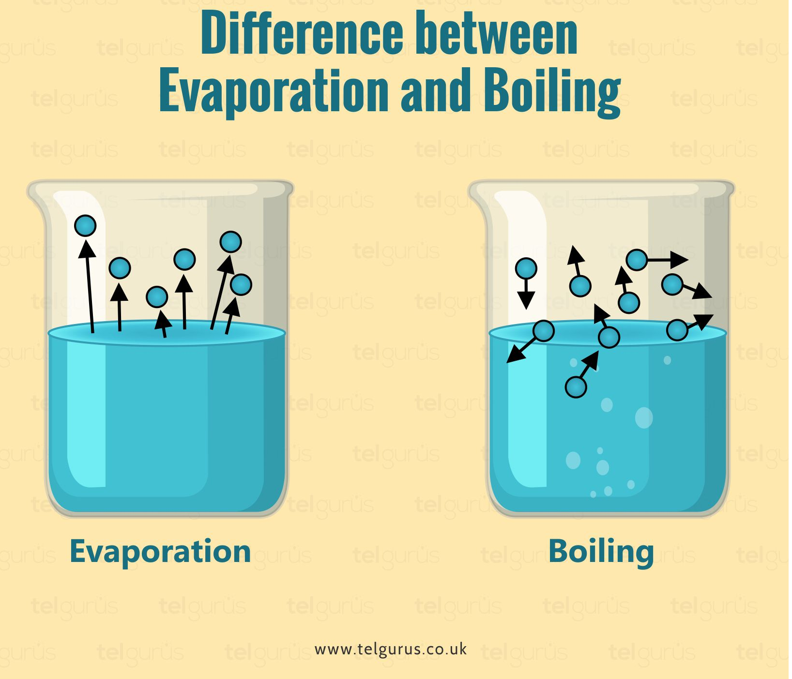

How to obtain salt from:

1.  Rock Salt

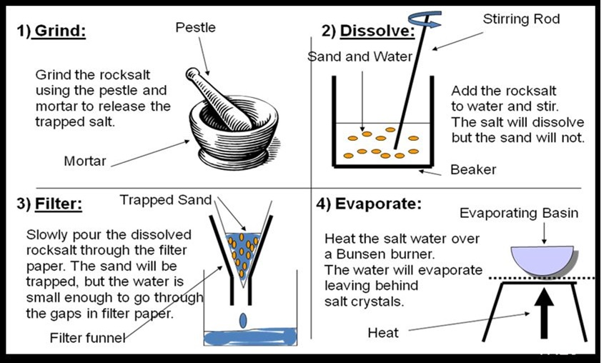

2. Sea water

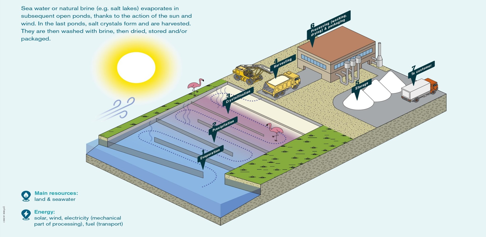

# Chromatography

Chromatography separates and helps identify different substances found in a mixture.

•After water is cleaned at a water treatment plant it must undergo tests to see what is dissolved in it.

•Chromatography is one of the techniques used in water analysis.

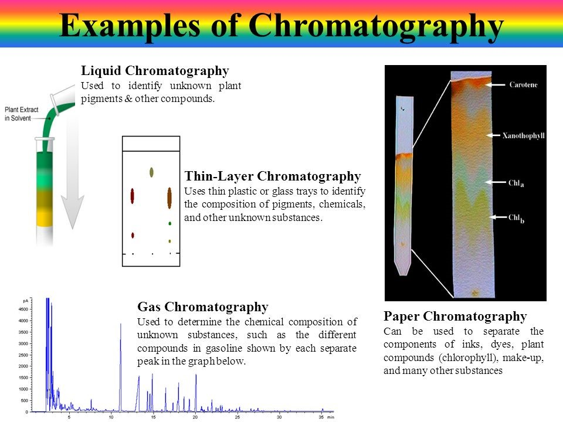

## Paper Chromatography

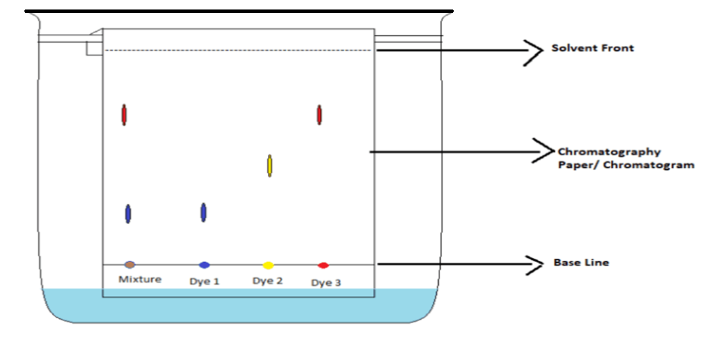

Method:

1.Place a concentrated dot of the solution you are testing on the base line of the chromatography paper

2.Suspend the chromatography paper in a beaker filled with a solvent that can dissolve your solution

3.Make sure the base line with concentrated dot of solution is above the solvent in beaker.

4.Cover the beaker with a lid to prevent the solvent evaporating away.

The solvent soaks up the paper and separates the dissolved solutes in the solution being analyzed. Each solute will be dissolved at different rates. The fastest solute will have travelled the furthest along the chromatography paper.

For analyzing colorless substances, UV light is used to make the solutes glow and become visible on chromatogram.

Uses of paper chromatography:

•Identifying the components in mixtures like water, food , urine, blood, sweat, soil and the atmosphere.

•Testing blood and urine samples of athletes for drugs

•Forensic analysis of crime scenes

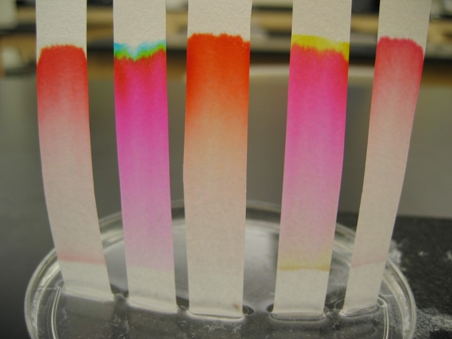

# Distillation

Drinking water may be made from sea water in a process called desalination. Distillation is a process during desalination in which the sea water is heated so that the water evaporates to form steam leaving behind the salt solutes. The steam is collected and cooled so that it condenses back into pure liquid water containing no solutes.

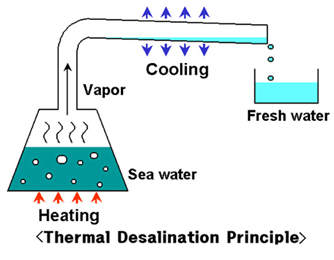

Solar still:

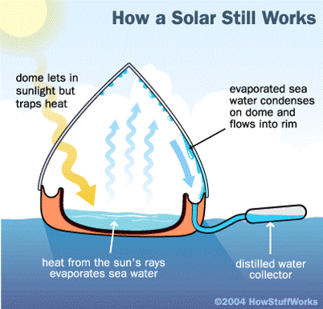

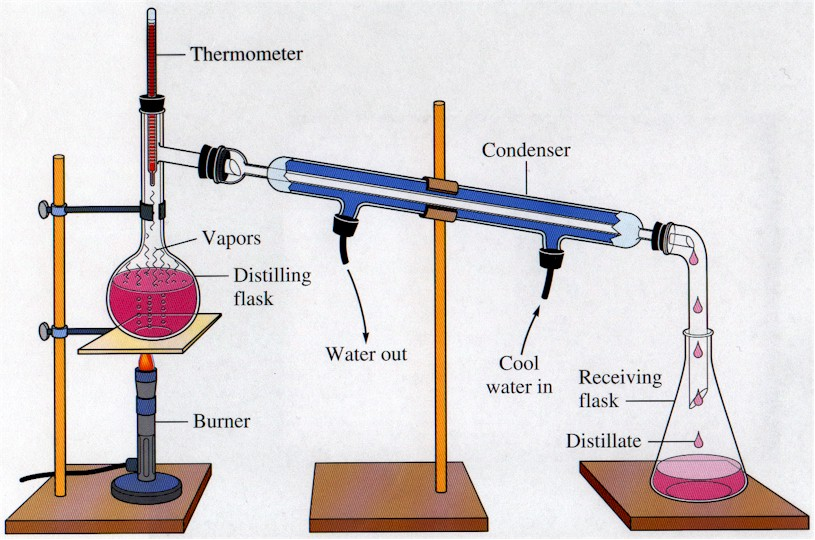

Factors affecting simple distillation:

•Amount of heat – the greater the heat available, the faster the distillation. Lab distillation is quicker than distillation using sunlight.

•Rate of condensation – Cold water into condenser should come from the bottom of the condenser instead of the top to ensure all the vapour has condensed before it leaves the condenser.

•Boiling point of the substances in the mixture should be far away from each other. The closer the boiling points of the substances in the mixture, the more impure the final product will be.