This chapter deals with the following subtopics:

\- Fertilisation

\- Adaptations of male and female gametes for fertilization

\- Internal vs External fertilisation

\- Internal vs External development

\- Reproduction in different animals

\- Human development and Birth

\- Puberty

**Fertilization**

Fertilization is the fusion of the male and female cell nuclei to form a zygote. 

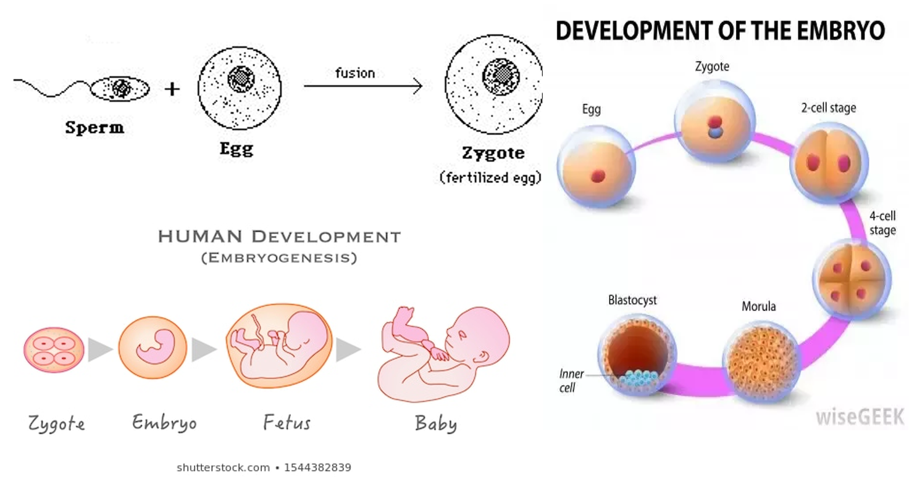

<!--StartFragment-->

# Adaptations of male and female gametes for fertilization

<!--EndFragment-->

<!--StartFragment-->

Sperm cells have these adaptations:

•a tail to move them towards an egg cell

•many mitochondria to provide energy

•the head that releases enzymes to digest the egg membrane

Egg cells have these adaptations:

•Large and bulky

•Contains yolk which contains a large food store for zygote.

<!--EndFragment-->

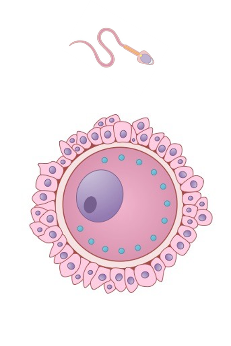

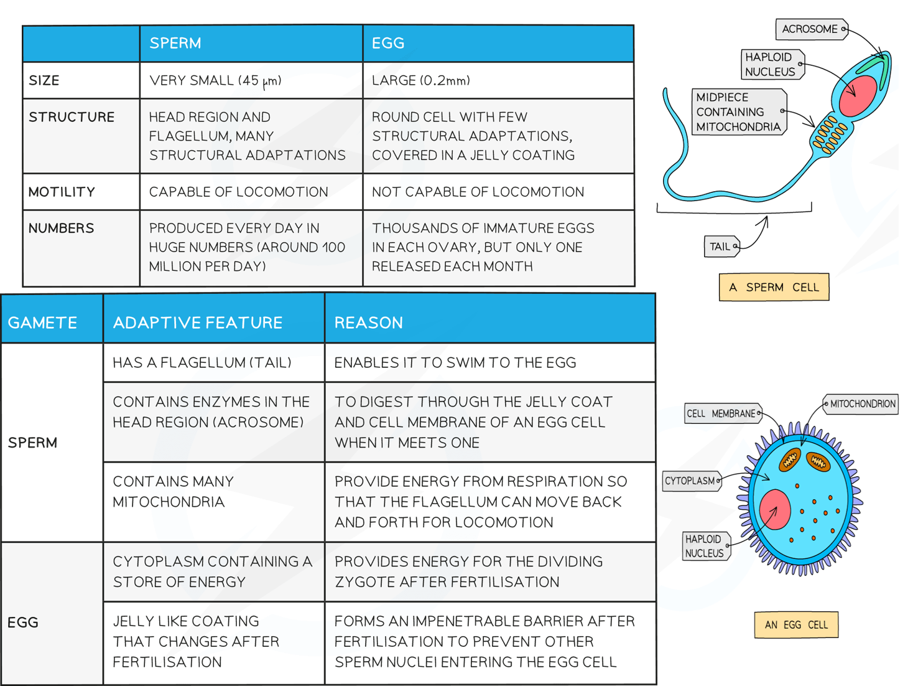

# Internal vs External Fertilization

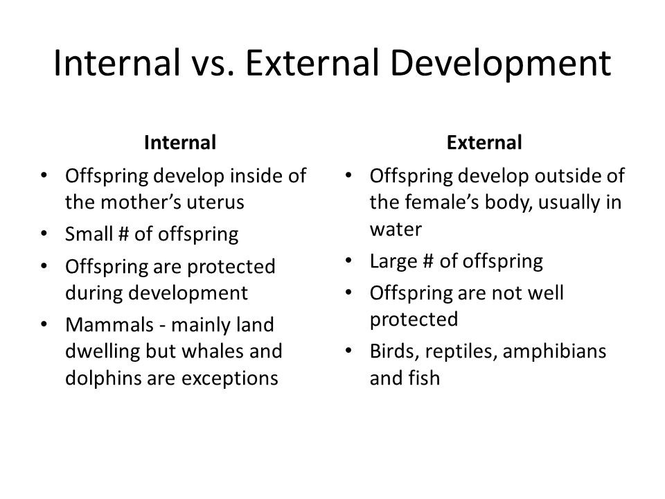

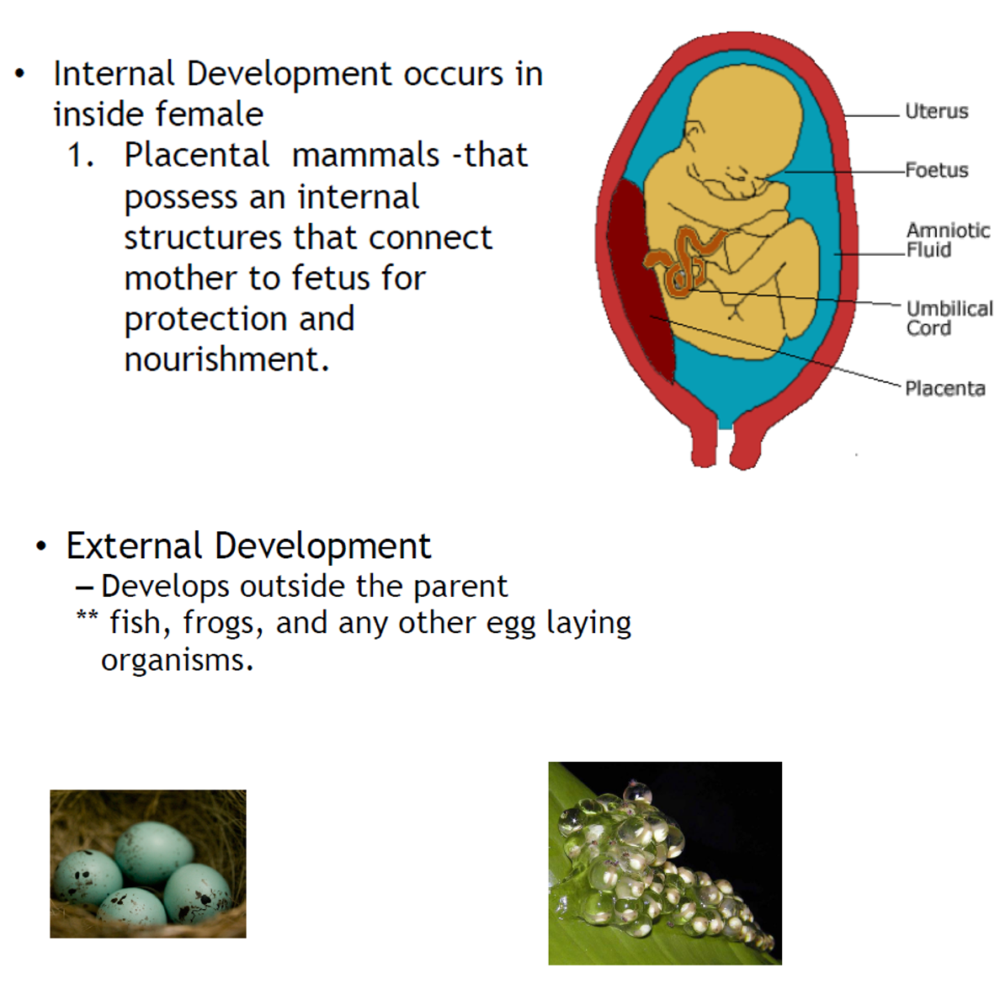

<!--StartFragment-->

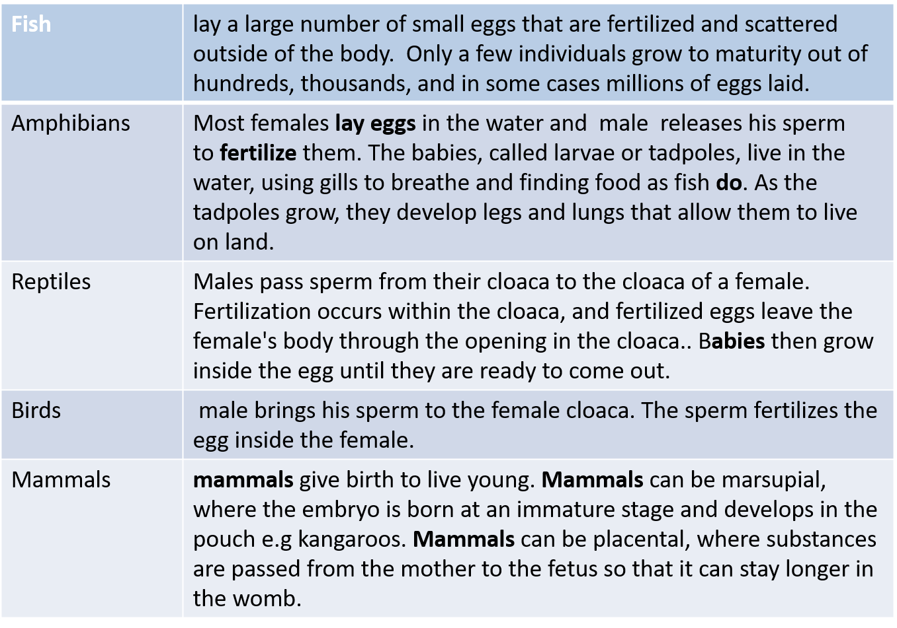

# Internal vs External development

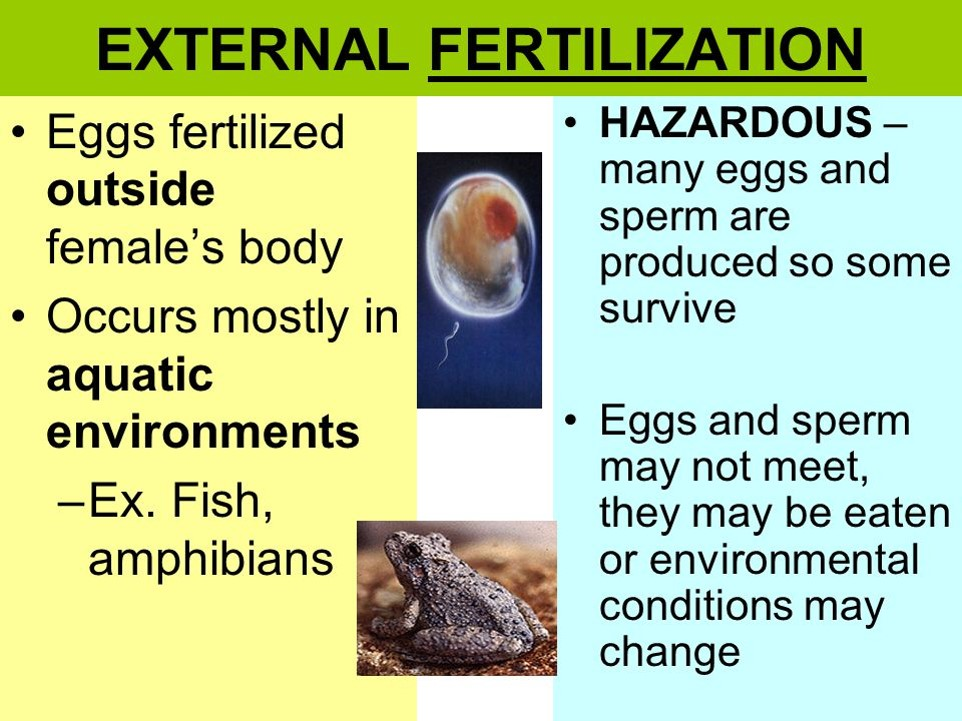

# Reproduction in different animals

<!--EndFragment-->

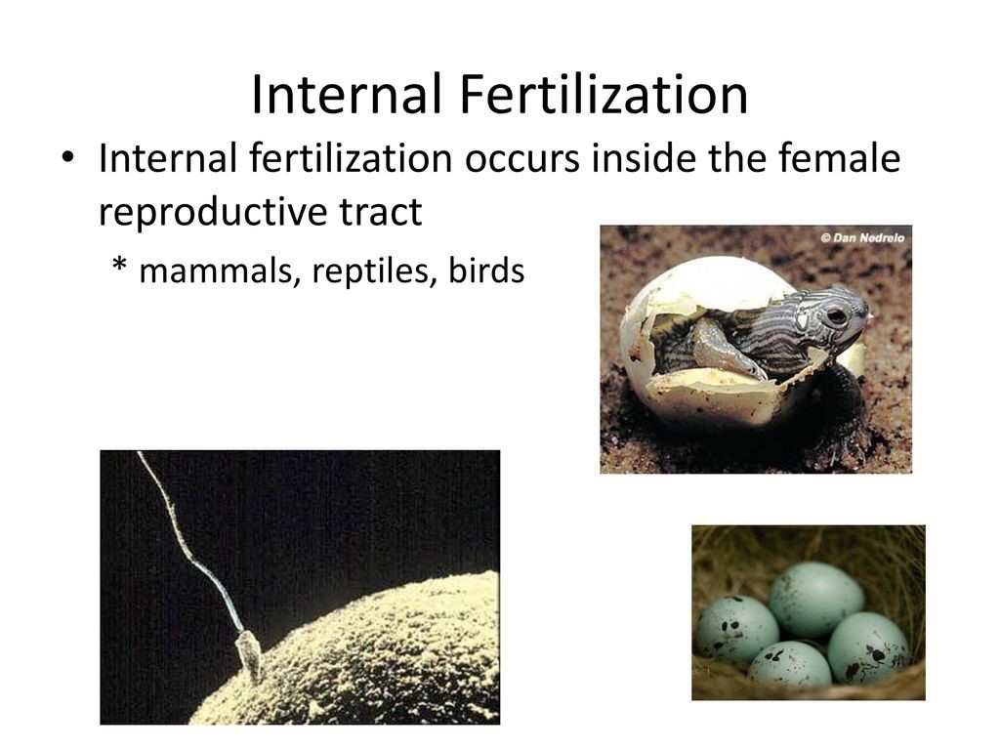

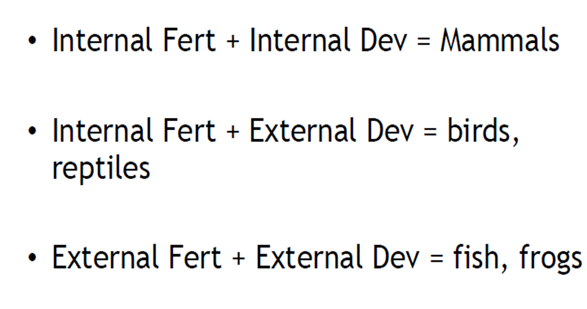

# Human Development and Birth

<!--StartFragment-->

The fertilized egg (zygote) divides to form a ball of cells called an embryo. The embryo attaches to the lining of the uterus. It begins to develop into a fetus and finally into a baby.

<!--EndFragment-->

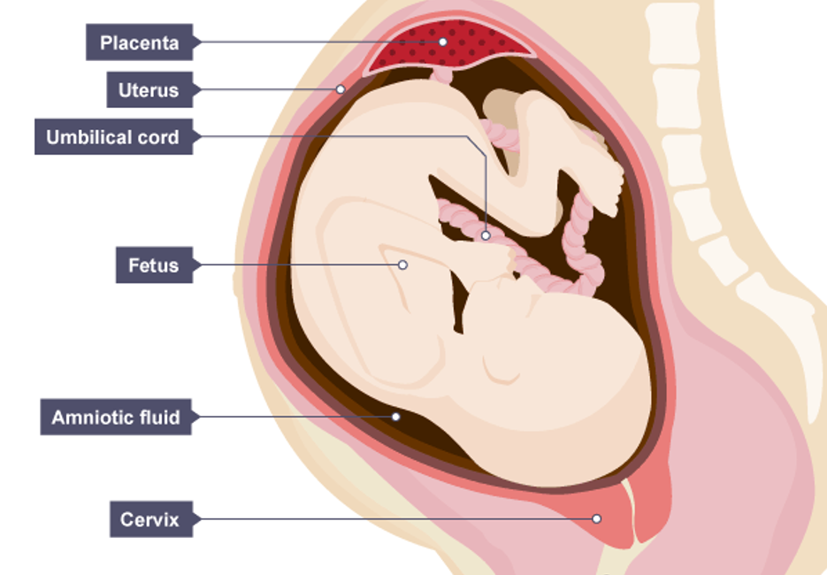

<!--StartFragment-->

The fetus is protected by the uterus and the amniotic fluid, a liquid contained in a bag called the amnion that acts as a shock absorber.

<!--EndFragment-->

## The Placenta

<!--StartFragment-->

•The placenta is an organ responsible for providing oxygen and nutrients to the baby, and removing waste substances. It grows into the wall of the uterus and is joined to the fetus by the umbilical cord.

<!--EndFragment--><!--StartFragment-->

The mother's blood does not mix with the blood of the fetus, but the placenta lets substances pass between the two blood supplies:

<!--EndFragment-->

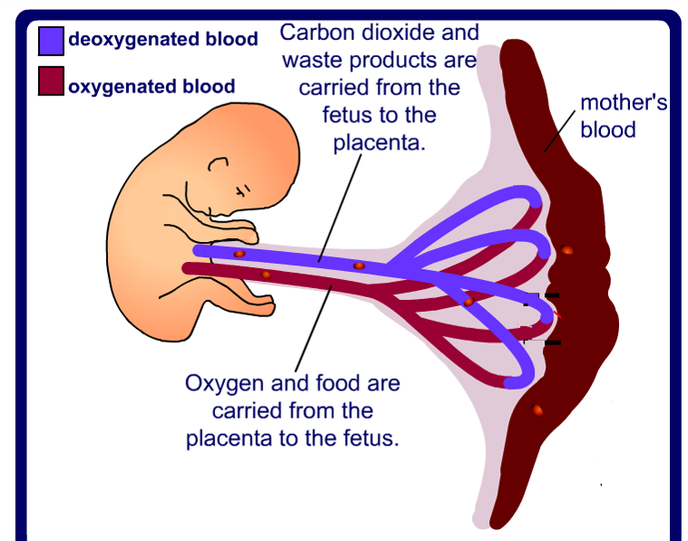

<!--StartFragment-->

The mother’s lifestyle can affect the developing fetus. For example, smoking reduces the amount of oxygen in the bloodstream. This can lead to low birth weight and premature birth (when a baby is born too soon). Drinking alcohol during pregnancy can harm the developing baby’s nervous system, especially its brain.

<!--EndFragment-->

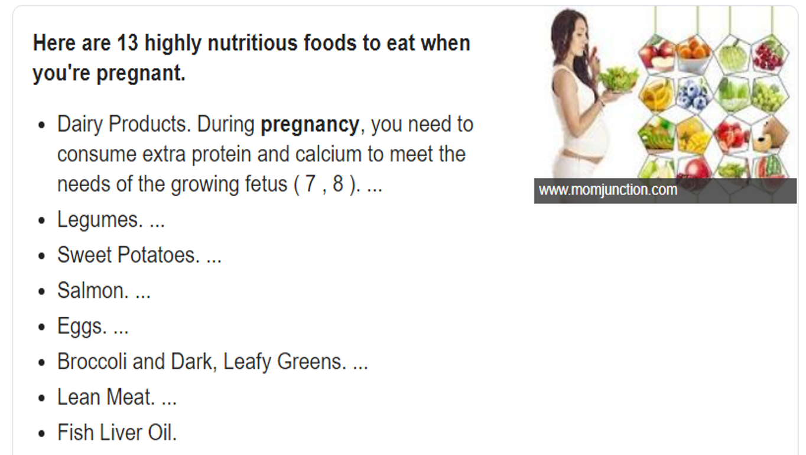

<!--StartFragment-->

Pregnancy cravings can be caused by a number of things, including hormones, a heightened sense of smell and taste, and nutritional deficiencies.

<!--EndFragment-->

## Birth

<!--StartFragment-->

•It takes about 40 weeks for a baby to develop in the uterus. This time is called gestation. After this, the baby is ready to be born. The muscles in the wall of the uterus contract. Waves of muscle contraction push the baby out of the mother's body.

<!--EndFragment-->

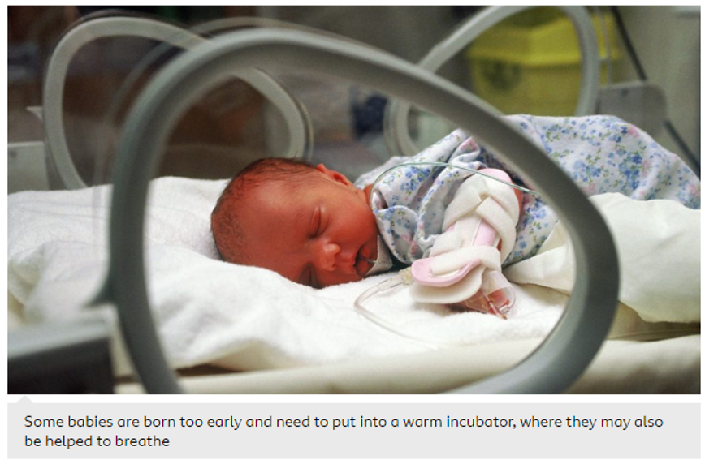

# Puberty

<!--StartFragment-->

•The reproductive system of a child is not mature. It needs to change as a boy or girl develops into an adult, so that the system is fully working. The time when the changes happen is called puberty.

•The changes happen because of sex hormones (chemicals produced in the testes of boys and ovaries of girls)

<!--EndFragment-->

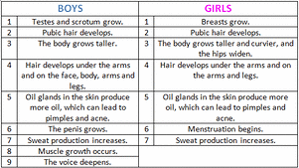

<!--StartFragment-->

The time between puberty and adulthood is called adolescence.

<!--EndFragment--><!--StartFragment-->

Here are some changes that happen to both boys and girls:

•underarm hair grows

•pubic hair grows

•body smell gets stronger

•emotional changes

•growth rate increases

<!--EndFragment-->

<!--StartFragment-->

## Menstrual Cycle in females

•The menstrual cycle involves the preparation of the uterus lining so that it is able to receive a fertilized egg. 

•If an egg is fertilized, it can implant itself in the prepared uterus lining.

•If it is not fertilized, the lining of the uterus breaks down and is lost from the body. This is called menstruation or a period.

•The menstrual cycle starts with menstruation (the loss of the uterus lining and some blood.).

• About 14 days after menstruation starts, an egg cell is released from an ovary. This is called ovulation.

•If the egg cell is not fertilized, the uterus lining starts to break down and the cycle starts again.

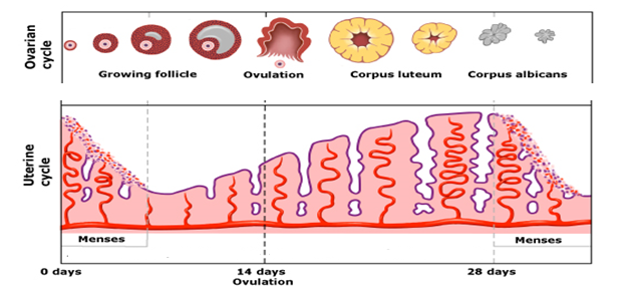