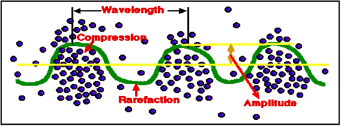
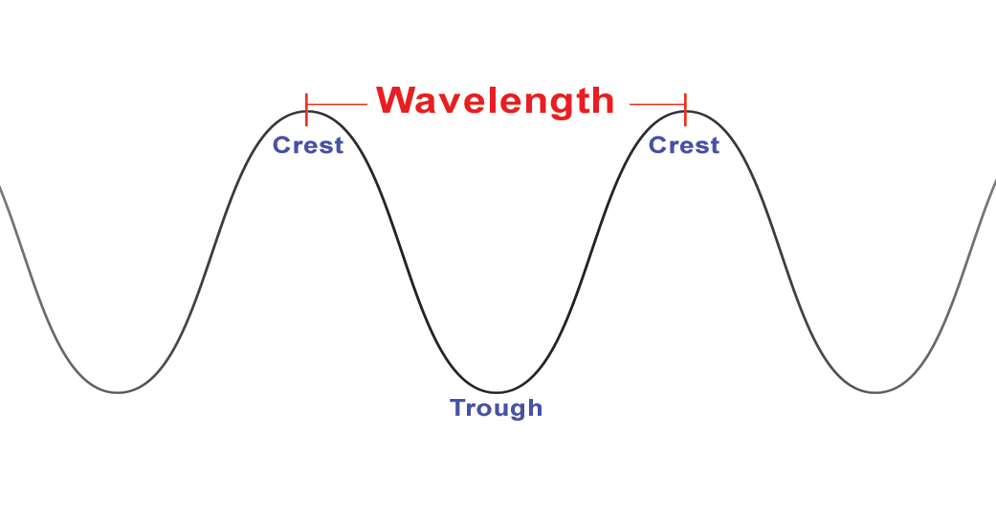

<!--StartFragment-->

•Sound is a vibration we can hear.

•A vibrating object makes sound

•Sound travels through air. It travels more quickly through solids than liquids or gases

•Speed of sound in air = 330m/s

•Sound needs particles to travel through them

•Sound cannot travel in a vacuum where there are no particles.

•Sound waves can pass through materials. 

<https://www.youtube.com/watch?v=ce7AMJdq0Gw>

A wave is a vibration or disturbance in space. 

Sound waves are longitudinal which means the direction of vibration is parallel to the direction of motion of the wave. Particles in a sound wave experience a back and forth movement. 

<https://www.youtube.com/watch?v=h90zbDXCW5o>

The sound wave contains high pressure areas where particles get closer called compressions and low pressure areas where particles are further away called rarefactions. 

Regions of compressions make the crest of the wave while areas of rarefactions make the trough of the wave. The distance between every two crests or every two troughs is called the wavelength.

