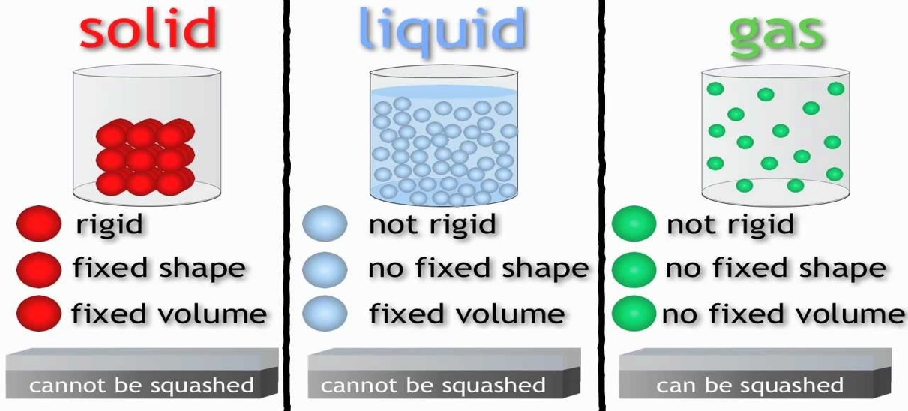
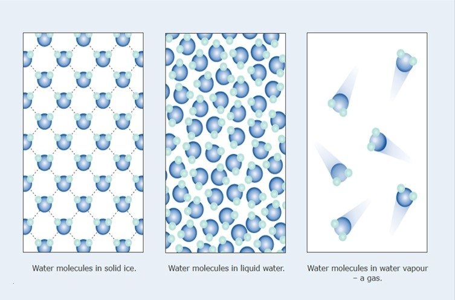
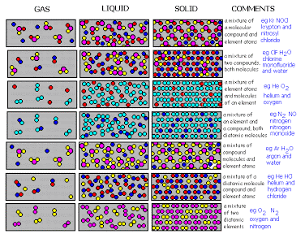
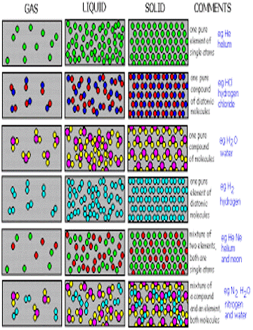
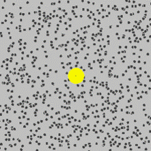
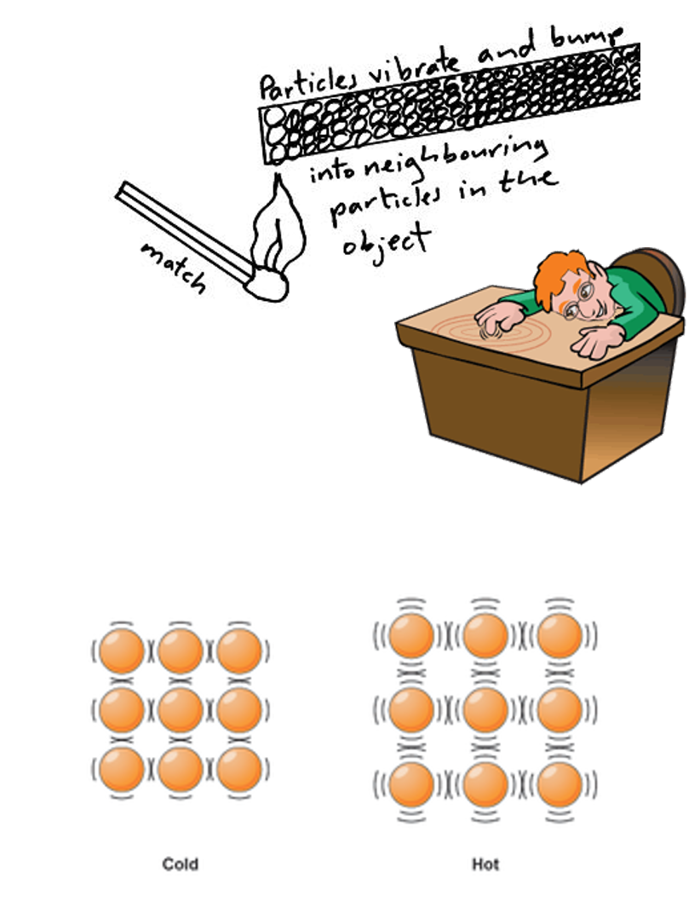
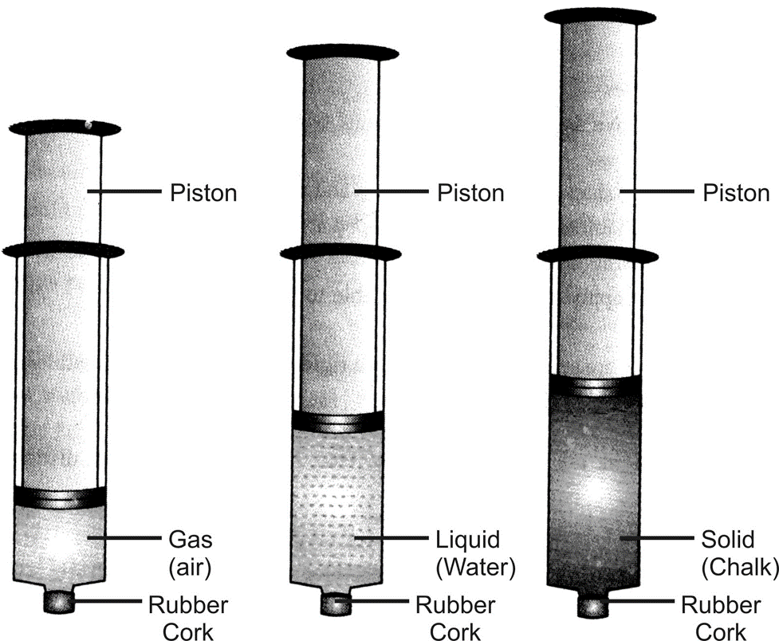
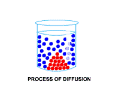
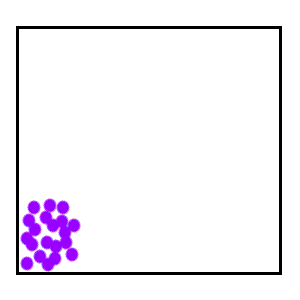

The Particle theory formed due to hypothesis supported by evidence.<!--EndFragment--><!--StartFragment-->

The Particle Theory states that:

<!--EndFragment--><!--StartFragment-->

* All matter is made up of tiny particles
* The particles are moving all the time
* There are forces of attraction holding the particles together
* These forces vary in strength in different states of matter.

<!--EndFragment-->

# Observations

<!--StartFragment-->

•Solids have a fixed shape

•Liquids can change their shape according to their container and flow unlike solids

•Gases have no fixed shape or volume

•Gases can be compressed but solids and liquids cannot.

<!--EndFragment-->

# Question

<!--StartFragment-->

•How does the movement, arrangement and forces of attraction between particles affect the shape, volume and compressibility of solids, liquids and gases?

<!--EndFragment-->

# Hypothesis

<!--StartFragment-->

Matter being able to keep its shape and volume and be compressed depends on how close the particles are, their movement and arrangement and the forces of attraction between them.

<!--EndFragment-->

# Predictions

<!--StartFragment-->

* If matter keeps its shape, then particles in it vibrate in fixed positions and are close together with strong forces of attraction.
* If matter keeps its volume, then its particles have strong forces of attraction
* If matter can be compressed, then its particles are spaced out and have weak forces of attraction

<!--EndFragment-->

<!--StartFragment-->

# Experiments 

In order to test the above hypothesis and predictions, the following experiments need to be done:

<!--StartFragment-->

## •Brownian Motion 

Pollen grains in water move about randomly. This proves that liquid water particles are moving about randomly pushing the solid pollen grains around. Specks of smoke move about randomly in air. This proves gas particles in air are moving about randomly in all directions and colliding with the specks of smoke making their movement random. Brownian motion proves that liquid and gas particles can move around.

<!--EndFragment-->

<!--StartFragment-->

## •Conduction of heat and sound in solids 

proves that solid particles vibrate in fixed positions and these vibrations can be transferred from particle to particle in a solid thereby transferring heat and sound energy in solids.

•Particles in solids vibrate faster when heated and when heated to melting point can break free into a liquid state. When heating continues heat causes the particles to move even faster (increase in kinetic energy) and move further apart and after reaching boiling point can become gas

<!--EndFragment-->

<!--StartFragment-->

## • Pressurizing solids, liquids and gases

Using a syringe to compress solids liquids and gases to prove that the syringe containing gas can easily be pushed in, showing gases can be compressed because their particles have greatest spacing between them.

<!--EndFragment-->

<!--StartFragment-->

## •Diffusion 

Diffusion (is the random movement of particles from where they are many to where they are few) occurring fastest in gases proves that gases do not have a fixed volume and their particles can move away from each other and fill up a container due to their weaker forces of attraction compared to liquids.

<!--EndFragment-->

<!--StartFragment-->