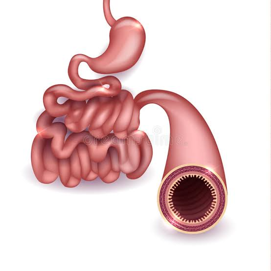

Food contains nutrients needed for energy, growth and repair, and for health.

Nutrition information labels can tell us how much of each nutrient can be eaten in a day (reference intake) and how much of that nutrient is in the particular food. This helps you know how much of the food you need to eat.

Nutrition labels give you the amount of energy in food (in kilo Joules and kilo Calories). 1 kilocalorie = 4 kiloJoules. Energy requirements change with age, type of activity and gender.

## Uses of Nutrients

* Water – transports the nutrients in the body, acts as a lubricant, fills up cells so that they hold their shape and cools us down when we sweat.
* Protein– help in making new cells for growth and repair. Found in meat, fish eggs, cheese, beans and milk.
* Carbohydrates– for energy. Found in starchy foods like bread and potatoes and sugary foods containing glucose.
* Lipids (fats and oils)– are a source of energy and provide insulation. Found in dairy products and oily foods. 
* Vitamins and minerals– for overall body health and protection from disease. 
* Fibre - is not a nutrient but needed as roughage – Fibre contains plant cell walls which cannot be digested but helps food move through the intestine to prevent constipation.

## Food Tests

* To test for the presence of **water** in a particular food, blue cobalt chloride paper is used. It turns pink, in the presence of water.

* To test for the presence of the carbohydrate **starch** in a particular food, iodine is used. Brown iodine turns blue-black in the presence of starch. 

* To test for the presence of **fats** in a particular food, add ethanol and then the same amount of water. A white emulsion will be formed if fats are present.

* To test for the presence of **protein** in a particular food, blue Biuret solution turns purple in the presence of protein.

#### Balanced Diet

A balanced diet contains the right amount of a wide variety of foods that can provide all nutrients + fibre for growth and repair, health and energy. 

#### Malnutrition

Too much or too little of a nutrient in your diet can make you malnourished.
Too much of carbohydrates and fats can cause obesity which leads to heart disease. The extra fat can clog arteries and cause heart attack. Higher pressure on artery walls results in high blood pressure which further damages the heart and bursts blood vessels and damages kidneys.

**Deficiency diseases** are caused by too little of a certain nutrient. The tables below show the vitamin and mineral deficiency diseases.

* Kwashiorkor is a deficiency disease caused by lack of protein in ones diet.  A pot belly is the symptom of this disease as muscles that hold the abdomen get weak.

* Lack of carbohydrates, fats and proteins cause starvation which causes anorexia (getting thinner and thinner)
* Too much of carbohydrates and fats with no exercise causes obesity

# The Digestive System

### Enzymes

Enzymes are biological catalysts that speed up digestion and don’t get used up in the process and remain unchanged.

### GUT BACTERIA

We have a mix of good and bad bacteria in our gut. Helicobacter Pylori causes ulcers, while Lactobacilli may ward off stress and anxiety.
Your diet can affect which bacteria grow and reproduce more than another. Taking **probiotics** containing good bacteria such as yoghurt can help keep your gut healthy. **Prebiotics** are fibers which our body cannot digest but good bacteria feed on. Taken together, prebiotics and probiotics can turn into a healthier, happier gut.

INFLUENCE OF GUT BACTERIA ON OUR BRAIN AND BODY
Gut bacteria influence our overall body health. Imbalances in the amounts of various bacteria causes:

* Depression & anxiety
* Irritable bowel syndrome – symptoms:  cramping, abdominal pain, bloating, gas, and diarrhea or constipation, or both.
* Colon cancer
* Changes in brain function
* Obesity & Diabetes

### ABSORPTION

After enzymes break up the large insoluble molecules into smaller soluble ones, the small molecules can be absorbed by the small intestine.

Digestion ends in the small intestine and the products of digestion (glucose, amino acids, glycerol and fatty acids) that are soluble molecules get absorbed into the blood inside the villi of the small intestine.

**Diffusion in small intestine** - Particles tend to evenly spread out by diffusion from a high to low concentration. 
After a meal, there are more digested nutrient molecules inside small intestine than in the blood. This causes the overall movement of the nutrient molecules into the blood by diffusion to achieve a balance of these nutrients in small intestine and in the blood. 

**Adaptations of small intestine for absorption** - The wall of the small intestine is folded with many villi that provide a large surface area for maximum absorption of nutrients into blood.
The wall of each villus is only one cell thick so nutrients do not have to diffuse far to get into the blood. This speeds up the absorption.

#### Visking tubing model of small intestine: 

Inside of tubing represents inside of small intestine. 

Outside of tubing represents the blood.

