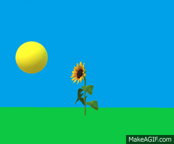
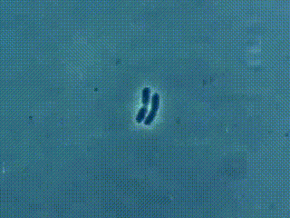
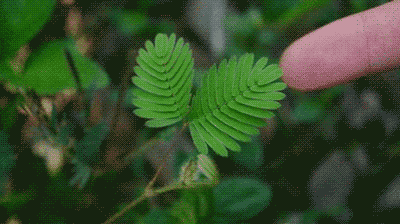
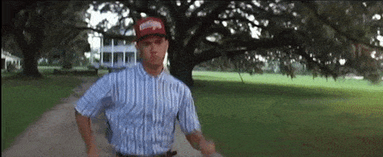
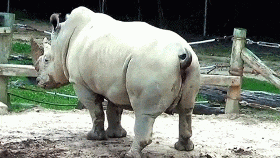
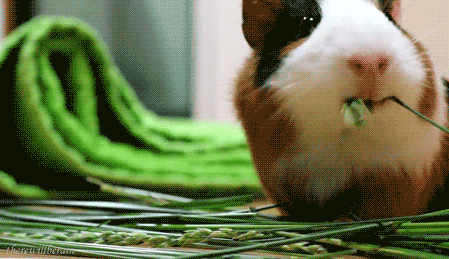
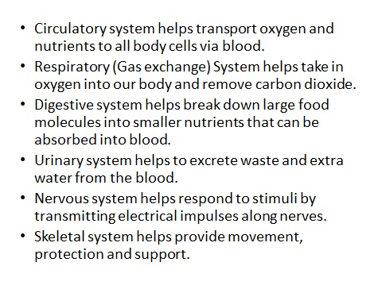
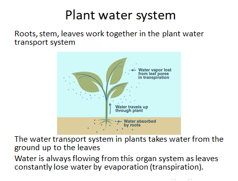

A **cell** is the smallest unit of life. 

Cells of the same type make a **tissue**. 

Different tissues make up an **organ**. 

Different organs work together in **organ systems**. 

Many organ systems make up a living thing – an **organism**. 

# **Life processes**

All organisms carry out the following life processes: 

* **Movement** - they can move from place to place or move parts of themselves.

  
* **Reproduction** - they can make more of themselves.

* **Sensitivity** - they can sense and respond to changes inside and outside their bodies called stimuli around them.

* **Growth** - they can increase in size.

* **Respiration** - they use glucose and oxygen to release energy.

* **Excretion** - they can produce waste and get rid of it.

* **Nutrition** - they require food for energy, growth and overall health. 

For anything to be living, it should be able to carry out all the above life processes.

# **Human & Plant Organ Systems**

* 

