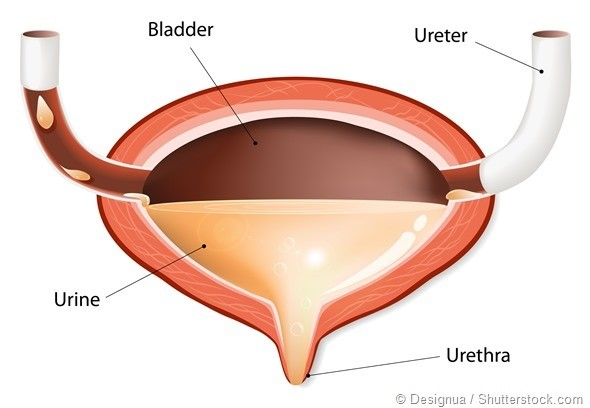

A **cell** is the smallest unit of life. 

Cells of the same type make a **tissue**. 

Different tissues make up an **organ**. 

Different organs work together in **organ systems**. 

Many organ systems make up a living thing – an **organism**. 

# **Life Processes**

All organisms including cells carry out the following life processes.

* **Movement** - they can move from place to place or move parts of themselves.

  
* **Reproduction** - they can make more of themselves.

* **Sensitivity** - they can sense and respond to changes inside and outside their bodies called stimuli around them.

* **Growth** - they can increase in size.

* **Respiration** - they use glucose and oxygen to release energy.

* **Excretion** - they can produce waste and get rid of it.

* **Nutrition** - they require food for energy, growth and overall health.

For anything to be living, it should be able to carry out all the above life processes.

<!--EndFragment-->

# **Human & Plant Organ Systems**

•Circulatory system helps transport oxygen and nutrients to all body cells via blood.

•Respiratory (Gas exchange) System helps take in oxygen into our body and remove carbon dioxide.

•Digestive system helps break down large food molecules into smaller nutrients that can be absorbed into blood.

•Urinary system helps to excrete waste and extra water from the blood.

•Nervous system helps respond to stimuli by transmitting electrical impulses along nerves.

•Skeletal system helps provide movement, protection and support.

Roots, stem, leaves work together in the plant water transport system

The water transport system in plants takes water from the ground up to the leaves by capillary action.

Water is always flowing from this organ system as leaves constantly lose water by evaporation (transpiration).

# Human & Plant Organs

The following are fundamental organs in the human body.

•**The brain** is the control center of the nervous system and is located within the skull. Its functions include muscle control and coordination, sensory reception and integration, speech production, memory storage, and processing of thought and emotion.

**•The heart** is a hollow, muscular organ that pumps blood through the blood vessels by repeated, rhythmic contractions.

•**The lungs** are two sponge-like, cone-shaped structures that fill most of the chest cavity. Their essential function is to provide oxygen from inhaled air to the bloodstream and to exhale carbon dioxide.

•**The liver** lies on the right side of the abdominal cavity. Its main function is to process and control the contents of the blood. This involves breaking down fats, producing urea, filtering harmful substances and maintaining a proper level of glucose in the blood.

•**The stomach** is a muscular, elastic, pear-shaped bag, lying crosswise in the abdominal cavity. Its main purpose is digestion of food through production of gastric juices (including hydrochloric acid) which break down, mix and churn the food into a thin liquid.

•**The intestines** are located between the stomach and the anus and are divided into two major sections: the small intestine and the large intestine. The function of the small intestine is to absorb most ingested food in the blood. The large intestine is responsible for absorption of water and excretion of solid waste material.

•**The kidneys** are two bean-shaped organs located at the back of the abdominal cavity, one on each side of the spinal column. Their function is to maintain the body’s chemical balance by excreting waste products and excess fluid in the form of urine.

•**The bladder** is a muscular organ located in the pelvic cavity. It stretches to store urine and contracts to release urine.

* **Roots** - anchor the plant to the ground and absorb water and minerals from the ground. 
* **Stem**- holds the plant upright and transports water and nutrients from roots to the leaves. 
* **Leaves** - trap sunlight to make food for the plant by the process of photosynthesis.
* **Plant storage organs e.g. bulbs, storage roots and tubers** - store food and water for the plant to use when needed:

# Human & Plant Tissues

Tissues contain cells of the same type that perform a certain function.

All organs are made up of tissues. Example: the heart is made up of muscle, nerve, fat and blood tissues.

* **Nerve tissue** - Made up of nerve cells which transmit electrical messages throughout the body

  

* **Muscle tissue** - made up of muscle cells.

