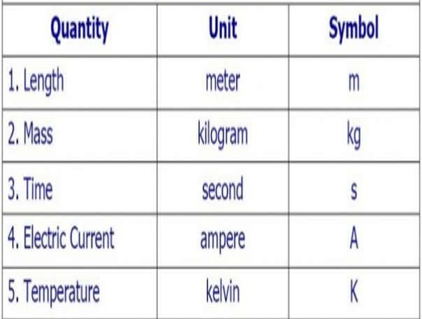
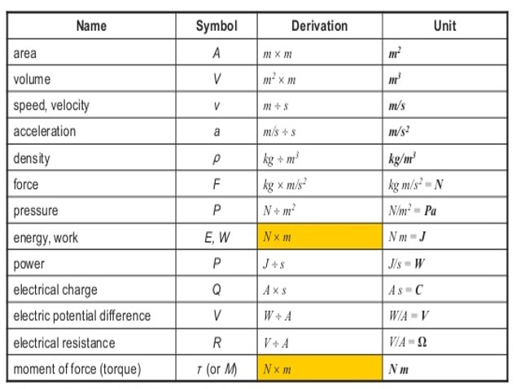

<!--StartFragment-->

SI units are an International System of units that are recognized and used in calculations by scientists world wide.

<!--EndFragment-->

## Fundamental SI Units 

<!--StartFragment-->

Derived units (from the fundamental units)

<!--EndFragment-->

